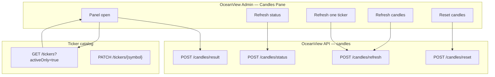
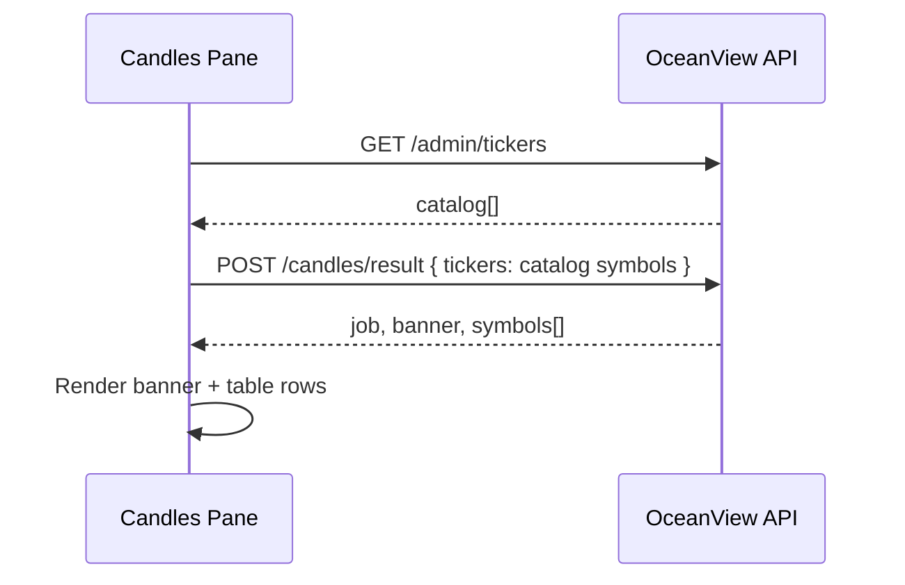
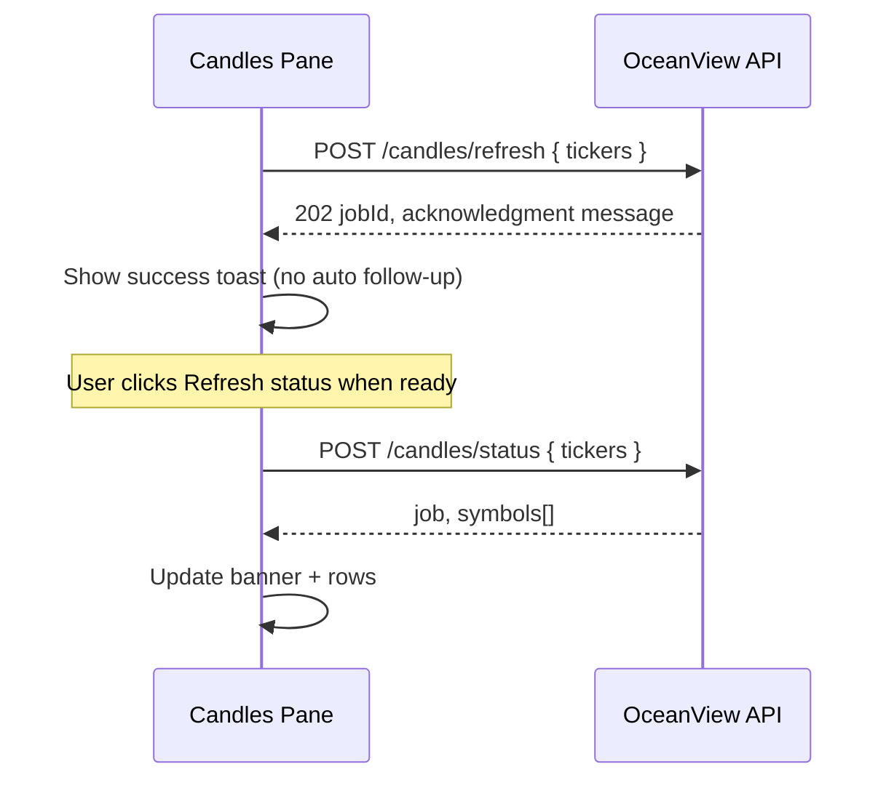
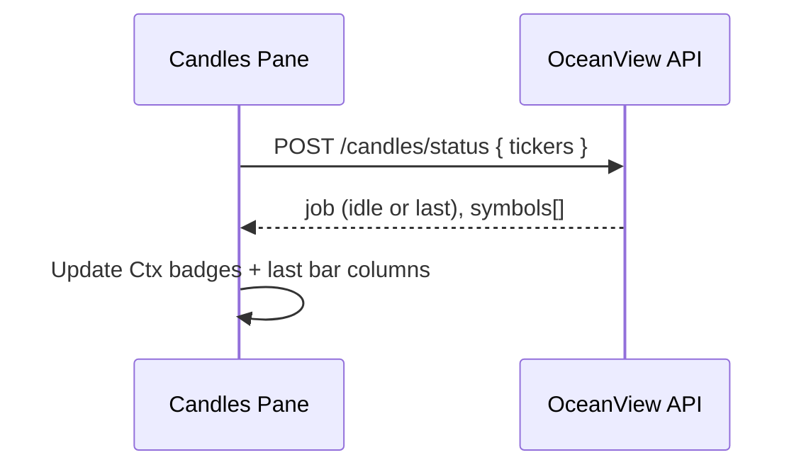

# Candles Pane (Admin)

Operational panel for **candle (OHLC bar) collection** — incremental refresh, full reset, and per-ticker status. Replaces the legacy InvestJournal **Ticker Context** pane, scoped to candles only (no earning calendar, no foundation eval, no strategy eval).

**Route:** `/admin`  
**UI title:** Candles  
**Subtitle:** Monitor ticker price data intake  

**Downstream:** Market **Assess** needs candle bars for active tickers — see [market-page.md](./market-page.md).

**Related repos:**

| Repo | Role |
|------|------|
| `OceanView` | React UI — this pane |
| `OceanView-API` | API Gateway + Python Lambdas — `candles/*` and `admin/tickers` |
| `FinanceAI` | Reference repo — port Python patterns; AWS stack deleted when OceanView replaces it |

---

## Scope

### In scope

- **Ticker catalog** pane — activate/deactivate symbols (`PATCH /tickers/{symbol}`)
- Load last **candles job** summary and per-symbol candle context
- **Refresh candles** (incremental D / 1h / 15m intake)
- **Reset candles** (full re-fetch)
- **Build movement profiles** (maintenance — ~1y hourly in memory; see Job Status `movement_profiles`)
- **Refresh status** (read current collection state without starting a job)
- Per-row **Refresh one ticker**
- English labels only

### Scheduled candle refresh (no UI click)

| | |
|--|--|
| **When** | **Weekdays 5:00 PM America/New_York** |
| **What** | Same incremental refresh as **Refresh candles** (D + 1h + 15m) for **all catalog** tickers |
| **How** | EventBridge rule `oceanview-weekday-candle-refresh` → Candles Lambda (`cron(0 17 ? * MON-FRI *)`) |
| **Batches** | 10 symbols per continue invoke |
| **Progress** | Admin → **Job Status** → Candles (`trigger: schedule`) |

Defined in OceanView-API `template.yaml` (`WeekdayCandleRefresh`, `State: ENABLED`) and `src/application/candle/scheduled_refresh.py`.

**Note:** EventBridge Scheduler does **not** send an `aws.events` envelope. The schedule Target `Input` must be set to  
`{"source":"oceanview.scheduled-candle-refresh","action":"start"}` (or the handler treats an empty `{}` as start). Without that, the Lambda returns in ~2ms and no candles refresh.

### Manual refresh / reset (avoids API Gateway 504)

| | |
|--|--|
| **HTTP** | `POST /candles/refresh` or `/candles/reset` returns **202** quickly (`status: running`) |
| **Work** | Same batching as the weekday job (10 tickers per Lambda continue) |
| **UI** | Candles pane polls `/candles/status` every ~2.5s until the job finishes and updates the table |
| **Also** | Weekday 5 PM ET job remains the automatic full-catalog refresh |

### Out of scope (other panes / APIs)

- Earning calendar
- Foundation / BB15 / pipeline eval
- Strategy eval (Result Now) — use [market-page.md](./market-page.md) `/market` instead
- MySQL / InvestJournal catalog

---

## UI → API overview

All **candles** endpoints accept a **`tickers`** array from the UI (uppercase symbols). The UI builds that list from the admin ticker catalog (all rows, or a future selection).



**No client-side polling.** The UI never loops on `candles/status`. After **Refresh candles** or **Reset candles**, show the API acknowledgment only. The user updates rows via **Refresh status** (or by reloading the pane → `candles/result`).

---

## Button → API matrix

| UI control | When | API | Purpose |
|------------|------|-----|---------|
| **Ticker catalog** add | Form submit | `POST /tickers` | Create catalog symbol |
| **Ticker catalog** toggle | User click | `PATCH /tickers/{symbol}` `{ active }` | Include/exclude from Market + Candles bulk |
| **Ticker catalog** reload | User click | `GET /tickers` | Full catalog (active + inactive) |
| *(Candles panel open)* | After catalog loads | `GET /tickers?activeOnly=true` | Active symbols only |
| *(Candles panel open)* | Immediately after | `POST /candles/result` | Last **candles job** outcome + per-symbol candle context |
| **Refresh status** | User click | `POST /candles/status` | Live collection state for requested tickers (no new job) |
| **Refresh candles** | User click | `POST /candles/refresh` | Start incremental intake; show acknowledgment message |
| **Reset candles** | User click (after confirm) | `POST /candles/reset` | Start full reset intake; show acknowledgment message |
| **Build movement profiles** | User click (after confirm) | `POST /candles/movement-profiles/build` `{ tickers, batchSize: 5 }` | Async 202 — ~1y hourly in memory, persist compact profile only |
| **Stop profiles** | User click | `POST /candles/movement-profiles/stop` | Stop after current batch |
| **Refresh** (row) | Per ticker | `POST /candles/refresh` `{ tickers: ["AAPL"] }` | Same as bulk, one symbol |

**After refresh/reset/profile build:** Do **not** poll. Display ack message. Profile progress lives under Admin → **Job Status** (`movement_profiles`). User clicks **Reload Result** for candle rows.

---

## API reference (OceanView-API)

Base path: `/api` or same-origin `/` (CloudFront → API Gateway). All requests use JSON and **`Content-Type: application/json`**. Auth: Cognito JWT (TBD) — omitted from examples.

### Shared request field

```json
{
  "tickers": ["AAPL", "MSFT", "NVDA"]
}
```

| Rule | Detail |
|------|--------|
| `tickers` | Required on all `candles/*` endpoints |
| Normalization | Server uppercases, dedupes, drops empty strings |
| Empty array | `400` — at least one symbol required |
| Unknown symbol | Included in response with `outcome: "unknown"` (not a hard error) |

---

### `GET /tickers`

**Purpose:** Catalog for Admin — not candle data.

**Query:** `activeOnly=true` — return only rows with `active: true` (used by Candles pane).

**Response `200`:**

```json
{
  "tickers": [
    {
      "symbol": "AAPL",
      "name": "Apple Inc.",
      "isFavorite": true,
      "active": true,
      "isOperationEnable": true
    }
  ]
}
```

Missing `isOperationEnable` on older Dynamo rows is treated as **`true`** (used by Operations; not edited in this pane).

### `POST /tickers`

**Purpose:** Create a catalog row (Dynamo `OceanView-Tickers`).

**Request:**

```json
{
  "symbol": "AAPL",
  "name": "Apple Inc.",
  "active": true,
  "isFavorite": false,
  "isOperationEnable": false
}
```

`symbol` is required. `name` optional. Defaults: `active: true`, `isFavorite: false`, `isOperationEnable: false`.

**Response `201`:** Created ticker object.  
**Response `409`:** Symbol already exists.

**Used by:** Admin Tickers pane **Add ticker** form.

### `PATCH /tickers/{symbol}`

**Purpose:** Activate or deactivate one catalog row (Dynamo `OceanView-Tickers`).

**Request:** `{ "active": true | false }`

The API also accepts `isOperationEnable` / `optimalRange` for other clients; the Tickers pane only toggles **Active**.

**Response `200`:** Updated ticker object (same shape as list item).

**Used by:** Ticker catalog pane Active toggle.

---

### Legacy doc note

Older drafts referenced `GET /admin/tickers`. The live route is **`GET /tickers`**.

---

### `POST /candles/result`

**Purpose:** Return the **last completed candles job** (or current session result) and **per-symbol candle context** — only fields related to candle collection, not full platform TickerContext.

**Request:**

```json
{
  "tickers": ["AAPL", "MSFT"]
}
```

**Response `200`:**

```json
{
  "job": {
    "jobId": "candles-20260624-001",
    "kind": "refresh",
    "status": "completed",
    "startedAt": "2026-06-24T09:15:00Z",
    "finishedAt": "2026-06-24T09:18:22Z",
    "summary": {
      "total": 2,
      "succeeded": 2,
      "failed": 0,
      "skipped": 0
    }
  },
  "banner": {
    "kind": "ok",
    "title": "Candle intake",
    "body": "Last run completed for 2 tickers."
  },
  "symbols": [
    {
      "symbol": "AAPL",
      "context": {
        "status": "ready",
        "lastBarAt": "2026-06-24T15:45:00-04:00",
        "intervals": {
          "daily": { "count": 120, "lastAt": "2026-06-23T16:00:00-04:00" },
          "hourly": { "count": 48, "lastAt": "2026-06-24T15:00:00-04:00" },
          "min15": { "count": 96, "lastAt": "2026-06-24T15:45:00-04:00" }
        },
        "error": null
      },
      "outcome": "success",
      "message": null
    },
    {
      "symbol": "MSFT",
      "context": {
        "status": "missing",
        "lastBarAt": null,
        "intervals": {},
        "error": null
      },
      "outcome": "skipped",
      "message": "No bars returned for session"
    }
  ]
}
```

| Field | Meaning |
|-------|---------|
| `job` | Last candles job metadata (refresh or reset) |
| `banner` | Alert strip at top of pane (`ok` \| `warn` \| `error` \| `running` \| `none`) |
| `symbols[].context` | **Candles-only** context slice (not full Dynamo TickerContext) |
| `symbols[].outcome` | This symbol’s result in that job: `success` \| `failed` \| `skipped` \| `unknown` |

**Used by:** Panel open; after refresh/reset completes.

---

### `POST /candles/status`

**Purpose:** **Live** collection state for the requested tickers — **Refresh status** button only (no polling loop in the UI).

**Request:**

```json
{
  "tickers": ["AAPL"]
}
```

Single-ticker and multi-ticker use the **same endpoint** (pass one element for one row).

**Response `200`:**

```json
{
  "job": {
    "jobId": "candles-20260624-002",
    "kind": "refresh",
    "status": "running",
    "startedAt": "2026-06-24T10:00:00Z",
    "finishedAt": null,
    "progress": {
      "completed": 1,
      "total": 3
    }
  },
  "symbols": [
    {
      "symbol": "AAPL",
      "context": {
        "status": "ready",
        "lastBarAt": "2026-06-24T15:45:00-04:00",
        "intervals": {
          "daily": { "count": 120, "lastAt": "2026-06-23T16:00:00-04:00" },
          "hourly": { "count": 48, "lastAt": "2026-06-24T15:00:00-04:00" },
          "min15": { "count": 96, "lastAt": "2026-06-24T15:45:00-04:00" }
        },
        "error": null
      },
      "outcome": "success",
      "message": null
    }
  ]
}
```

| `job.status` | UI behavior |
|--------------|-------------|
| `running` | Show running banner (user may click **Refresh status** again later) |
| `completed` | Show ok banner; update rows from `symbols` |
| `failed` | Show error banner |
| `partial` | Show warn banner; update rows from `symbols` |
| `idle` | No active job — `symbols` still returned |

**Used by:** **Refresh status** button only.

---

### `POST /candles/refresh`

**Purpose:** Start **incremental** candle intake (D + 1h + 15m) for the given tickers.

**Request:**

```json
{
  "tickers": ["AAPL", "MSFT"]
}
```

**Response `202`:**

```json
{
  "jobId": "candles-20260624-002",
  "kind": "refresh",
  "status": "running",
  "message": "Candle refresh started. Use Refresh status when ready.",
  "tickers": ["AAPL", "MSFT"]
}
```

**Used by:** **Refresh candles**; per-row **Refresh**.

---

### `POST /candles/reset`

**Purpose:** Start **full reset** re-fetch of candles for the given tickers.

**Request:**

```json
{
  "tickers": ["AAPL", "MSFT"]
}
```

**Response `202`:** Same shape as refresh; `"kind": "reset"`.

**Used by:** **Reset candles** (destructive — confirm in UI).

---

### `POST /candles/movement-profiles/build`

**Purpose:** Async maintenance — fetch ~1 year of **1h RTH** bars **in memory**, compute `MovementProfile`, persist compact DTO to `OceanView-MovementProfiles`. Does **not** write bars to `OceanView-Candles`.

**Request:**

```json
{
  "tickers": ["AAPL", "MSFT"],
  "batchSize": 5
}
```

**Response `202`:**

```json
{
  "runId": "mvprof-20260719-120000",
  "kind": "build_movement_profiles",
  "status": "running",
  "message": "Movement profile build started. Check Job Status or Reload when ready.",
  "tickers": ["AAPL", "MSFT"],
  "batchSize": 5
}
```

**409** if a profile job is already running. Progress: `GET /jobs/status` → `jobType: movement_profiles`.

### `POST /candles/movement-profiles/stop`

Sets `stopRequested` on the active job; worker finishes the current batch of 5 then stops.

### `POST /candles/movement-profiles/status`

**Request:** `{ "tickers": [...] }` — returns `lastRun` + per-symbol stored profile summary (`moveCapPct`, `sampleSize`, `expectedExitPrice`, …).

---

## Sequence diagrams

### Panel open



### Refresh candles (bulk) — no polling



### Refresh status (no job)



---

## UI specification

### Header

| Element | Text |
|---------|------|
| Title | Candles |
| Subtitle | Monitor ticker price data intake |
| **Refresh status** | Was “Consultar AWS” — reads `candles/status` |
| **Refresh candles** | Was “Actualizar barras” |
| **Reset candles** | Was “Reset barras” |

Removed from legacy pane: Request Earning Calendar, Refresh + foundation.

### Table columns

| Column | Source |
|--------|--------|
| ★ | `GET /admin/tickers` → `isFavorite` |
| Symbol / name | Catalog |
| Intake outcome | `symbols[].outcome` from `result` or `status` |
| Context | `symbols[].context.status` (`ready` / `missing` / `error`) |
| Last bar | `symbols[].context.lastBarAt` |
| Intervals detail | `symbols[].context.intervals` (expandable) |
| Actions | Row **Refresh** → `candles/refresh` with single ticker |

### Banner mapping

| `banner.kind` | Style |
|---------------|-------|
| `ok` | Green — last job succeeded |
| `warn` | Amber — partial failures |
| `error` | Red — job failed |
| `running` | Amber — job in progress |
| `none` | Gray — no job today |

---

## OceanView UI file plan

```
src/features/admin/
  AdminPage.tsx                 # TickersPane + CandlesPane
  tickers/
    TickersPane.tsx             # catalog filters + add form + active toggle
    AddTickerForm.tsx
    TickersTable.tsx
    TickerMovementInfoPanel.tsx # expanded row: stacked label-above-value metrics (no wide L/R gap)
    types.ts
    api/tickers-client.ts       # GET/POST /tickers, PATCH /tickers/{symbol} (active)
    hooks/useTickersPane.ts
  candles/
    CandlesPane.tsx             # collapsible panel + toolbar
    CandlesTable.tsx            # ticker rows
    CandlesBanner.tsx           # job summary alert
    types.ts                    # mirrors API DTOs
    api/
      candles-client.ts         # fetch wrappers (mock flag for dev)
      mock-data.ts              # until OceanView-API exists
    hooks/
      useCandlesPane.ts         # load, button handlers (no polling)
src/shared/components/
  CollapsibleSection.tsx        # reusable header + chevron
```

---

## OceanView-API file plan (later)

```
OceanView-API/
  template.yaml
  openapi/candles.yaml
  src/handlers/
    admin_tickers.py
    candles_result.py
    candles_status.py
    candles_refresh.py
    candles_reset.py
  src/application/
    candles_service.py          # orchestration, polling state
  src/infrastructure/
    ticker_store.py             # DynamoDB catalog
    candles_job_store.py        # job + per-symbol outcomes
    financeai_adapter.py        # temporary bridge during migration
```

---

## Implementation plan

### Now (OceanView UI only)

#### Phase 0 — Spec ✅

- [x] API names and button mapping
- [x] Request/response shapes
- [x] No client-side polling

#### Phase 1 — UI shell ✅

- [x] `CollapsibleSection` (ocean theme)
- [x] `CandlesPane` layout, English copy, mock catalog
- [x] Types + mock client returning fixture JSON
- [x] Wire into `AdminPage.tsx`

#### Phase 2 — UI behavior (mock client) ✅

- [x] `useCandlesPane`: catalog → `result` on open
- [x] **Refresh status** → single `status` call (no loop)
- [x] **Refresh candles** / row refresh → mock `refresh`; show acknowledgment only
- [x] **Reset candles** → confirm dialog → mock `reset`; show acknowledgment only
- [x] Row-level refresh (single ticker in `tickers` array)

**Explicitly out of Phase 2:** polling, timers, interval refetch, live API wiring.

---

### Later phases (historical roadmap)

Phases 3–5 below are largely **done** for candles (live API + CloudFront `/api/*`). Use [deploy-aws.md](./deploy-aws.md) and `OceanView-API/README.md` for current deploy steps.

#### Phase 3 — OceanView-API read paths ✓

- `GET /admin/tickers`
- `POST /candles/result`
- `POST /candles/status`
- Point UI `VITE_API_BASE_URL` at API

#### Phase 4 — OceanView-API write paths ✓

- `POST /candles/refresh` (async job, 202)
- `POST /candles/reset`
- Job tracking in `candles/status`
- FinanceAI bridge during migration

#### Phase 5 — Infra ✓

- Cognito authorizer
- CloudFront `/api/*`
- Retire FinanceAI bar paths

---

## Migration note (FinanceAI reference only)

OceanView-API is built as a **new stack** with `OceanView-*` DynamoDB tables. FinanceAI is used to **port Python logic** (bar intake, Schwab client), not as a runtime API or shared database.

External contract for OceanView UI is **`candles/*`** and **`market/*`** — never expose legacy FinanceAI paths to the browser.

---

## Cursor prompts (copy later)

**Build API:**

> Implement OceanView-API per `OceanView/docs/candles-pane.md`: `GET /admin/tickers`, `POST /candles/result`, `POST /candles/status`, `POST /candles/refresh`, `POST /candles/reset`. All candles routes require `{ "tickers": string[] }`. Python SAM, thin handlers.

**Build UI (Phases 1–2 only):**

> Implement Admin Candles Pane per `OceanView/docs/candles-pane.md`. English labels. Mock client only. No polling. Subtitle: "Monitor ticker price data intake". Reset requires confirm dialog. After refresh/reset show message only; user clicks Refresh status to update rows.

---

## Related docs

| Doc | Purpose |
|-----|---------|
| [README.md](./README.md) | Documentation index |
| [market-page.md](./market-page.md) | Market Assess (consumes candle data) |
| [environment.md](./environment.md) | `VITE_USE_MOCK_CANDLES` |
| [aws-urls.md](./aws-urls.md) | Production API URLs |
| `OceanView-API/README.md` | API deploy |
