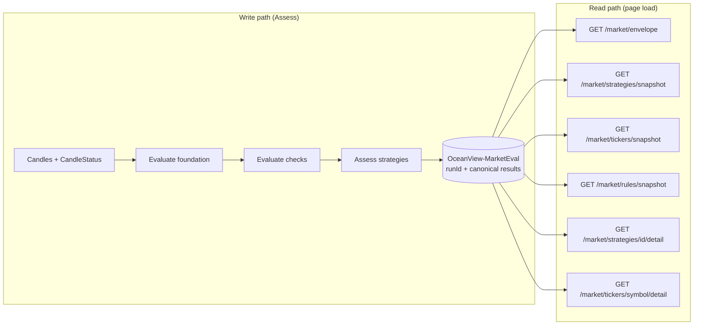
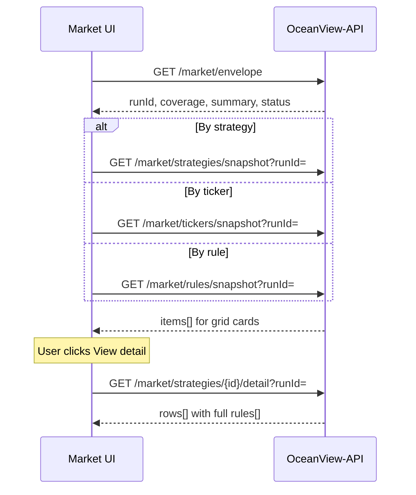

# Market backend plan (document only)

OceanView Market evaluates once, stores the canonical run, then serves **lean snapshots** for grid thumbnails and **detail** payloads on demand. The UI routes by view mode (`/market/strategies`, `/market/tickers`, `/market/rules`) and persists mode in `localStorage`; live APIs follow the same split.

**Not implemented** — this document and [market-api-contract.md](./market-api-contract.md) are the UI-side spec. **Backend execution plan:** [OceanView-API/docs/market-plan.md](https://github.com/mlsloynaz/OceanView-API/blob/main/docs/market-plan.md).

---

## API map (quick reference)

| When | Method | Path | Alias |
|------|--------|------|-------|
| Page load | `GET` | `/market/envelope` | page bootstrap |
| Page load (cache) | `GET` | `/market/strategies` | strategy catalog |
| Grid: By strategy | `GET` | `/market/strategies/snapshot?runId=` | `strategySnapshot` |
| Grid: By ticker | `GET` | `/market/tickers/snapshot?runId=` | `tickersSnapshot`, `byTickers` |
| Grid: By rule | `GET` | `/market/rules/snapshot?runId=` | `rulesSnapshot`, `byRules` |
| View detail | `GET` | `/market/strategies/{id}/detail?runId=` | — |
| View detail | `GET` | `/market/tickers/{symbol}/detail?runId=` | — |
| View detail (v2) | `GET` | `/market/rules/{ruleKey}/detail?strategyId=&runId=` | — |
| Assess | `POST` | `/market/evaluate` | runs pipeline |
| Poll | `GET` | `/market/evaluate/{runId}` | async jobs |
| Universe | `GET` | `/tickers` | existing Admin API |
| Debug only | `GET` | `/market/snapshot?runId=` | full canonical blob |

**Query on all read endpoints:** `runId` (preferred, from envelope) or `simulationTimeEt` (lookup latest run for that moment).

---

## Core idea

After **Assess**, the BFF writes one document keyed by `runId`. Read endpoints are **projections** of that store — not re-runs of FinanceAI unless the user triggers a new eval.



---

## Internal pipeline (OceanView-API)

Same mental model as FinanceAI, four stages:

| Stage | Input | Output |
|-------|--------|--------|
| **1. Candles** | `OceanView-Candles`, `OceanView-CandleStatus` | OHLC bars, coverage window |
| **2. Evaluate foundation** | bars + `simulationTimeEt` | session context, trade date, per-symbol bar availability |
| **3. Evaluate checks** | foundation + rule definitions | per `(symbol, ruleKey)` → `status`, `metAtEt`, evidence |
| **4. Assess strategies** | checks + strategy catalog | per `(symbol, strategyId)` → `qualityPct`, direction, rollups, `achievedAtEt` |

**Persist:** DynamoDB `OceanView-MarketEval` (or job result blob in S3 for large runs). Optional job row in `OceanView-JobsStatus` for async polling.

FinanceAI remains a **reference** for porting evaluation logic into OceanView-API (see master [plan.md](./plan.md)); the BFF adapter maps FinanceAI checklist shapes to OceanView DTOs during migration.

---

## Recommended APIs

### Always on page load

| Method | Path | Purpose |
|--------|------|---------|
| `GET` | `/market/envelope` | Bootstrap: `runId`, `simulationTimeEt`, `candleCoverage`, summary counts, `status` |
| `GET` | `/market/strategies` | Strategy + rule catalog (cacheable; version in envelope) |

### One snapshot per active view mode (thumbnails only)

| Method | Path | UI route | Thumbnail needs |
|--------|------|----------|-----------------|
| `GET` | `/market/strategies/snapshot` | `/market/strategies` | signal count, up to 4 ticker previews with quality |
| `GET` | `/market/tickers/snapshot` | `/market/tickers` | signal count, best signal, lean rule icon strip |
| `GET` | `/market/rules/snapshot` | `/market/rules` | met count / total symbols, preview symbols per rule |

Query: `runId` (preferred, from envelope) or `simulationTimeEt`.

### Detail on **View detail** click

| Method | Path | Returns |
|--------|------|---------|
| `GET` | `/market/strategies/{strategyId}/detail` | Full ticker table + all rules per row |
| `GET` | `/market/tickers/{symbol}/detail` | Accordion per strategy + full rules |
| `GET` | `/market/rules/{ruleKey}/detail` | Optional v2 — all tickers for one rule (`?strategyId=`) |

### Write + async

| Method | Path | Purpose |
|--------|------|---------|
| `POST` | `/market/evaluate` | Run pipeline at `simulationTimeEt`; returns `runId` |
| `GET` | `/market/evaluate/{runId}` | Poll job; on `complete`, UI re-fetches envelope + active snapshot |

### Supporting (existing / shared)

| Method | Path | Purpose |
|--------|------|---------|
| `GET` | `/tickers` | Active universe for eval |
| `GET` | `/market/snapshot?runId=` | **Debug/admin only** — full canonical `results[]`; not for grid load |

---

## UI load sequence



After **Assess**: `POST /market/evaluate` → poll if needed → re-fetch envelope → re-fetch snapshot for current mode.

---

## URL + localStorage (UI — implemented)

| Route | View mode | Snapshot API |
|-------|-----------|--------------|
| `/market` | redirect | → `localStorage` key `oceanview.market.viewMode` (default `strategies`) |
| `/market/strategies` | By strategy | `GET /market/strategies/snapshot` |
| `/market/tickers` | By ticker | `GET /market/tickers/snapshot` |
| `/market/rules` | By rule | `GET /market/rules/snapshot` |

Mode changes update **both** URL and `localStorage` so refresh and deep links match.

Implementation: `src/features/market/lib/market-routes.ts`, `MarketRedirect.tsx`, `router.tsx`.

---

## Canonical store vs projections

**Stored once per run** (internal shape, same as today’s mock `market-snapshot.json`):

- `results[]` — one row per ticker, each with `strategies[]` and nested `rules[]`

**Projections** (computed at read time or pre-indexed):

| Projection | Derived from |
|------------|--------------|
| `strategies/snapshot` | Group by `strategyId`; count signals; top-N tickers by quality |
| `tickers/snapshot` | Group by `symbol`; best strategy; lean rules for icon strip |
| `rules/snapshot` | Flatten `(strategyId, ruleKey)`; count met across symbols |
| `strategies/{id}/detail` | Filter `results[]` where strategy eval exists |
| `tickers/{symbol}/detail` | Single `results[]` row |

Pre-computing snapshot slices at write time is optional; projecting from the canonical blob is enough for v1.

---

## Implementation phases (backend — not started)

| Phase | Scope |
|-------|--------|
| **M1** | `GET /market/envelope` + `GET /market/candle-coverage` from CandleStatus |
| **M2** | `POST /market/evaluate` pipeline (port FinanceAI stages) + persist run |
| **M3** | Snapshot endpoints (`strategies`, `tickers`, `rules`) |
| **M4** | Detail endpoints |
| **M5** | Wire Market UI off mock JSON (`market-data.ts`) |

UI can stay on mock until M3; split mock files per endpoint shape when ready.

---

## Response examples (snapshot shapes)

### `GET /market/envelope`

```json
{
  "runId": "mkt-20260625-143022",
  "evaluatedAt": "2026-06-25T18:30:22Z",
  "simulationTimeEt": "2026-06-25T14:30:00-04:00",
  "tradeDate": "2026-06-25",
  "signalThresholdPct": 50,
  "catalogVersion": "1",
  "status": "complete",
  "candleCoverage": {
    "timezone": "America/New_York",
    "earliestAt": "2026-06-20T09:30:00-04:00",
    "latestAt": "2026-06-25T16:00:00-04:00"
  },
  "summary": {
    "strategyCount": 5,
    "tickerCount": 12,
    "activeSignals": 7,
    "ruleCount": 28
  }
}
```

### `GET /market/strategies/snapshot`

Everything **StrategyCard** needs — no detail click.

```json
{
  "runId": "mkt-20260625-143022",
  "items": [
    {
      "strategyId": "estrategia-02",
      "name": "Midpoint Bounce",
      "entryWindow": "Hours to 2 days (daily MA20 bounce)",
      "signalCount": 1,
      "previewTickers": [
        { "symbol": "LOW", "qualityPct": 50, "achievedAtEt": "10:42 AM" }
      ]
    }
  ]
}
```

### `GET /market/tickers/snapshot`

Everything **TickerCard** needs.

```json
{
  "runId": "mkt-20260625-143022",
  "items": [
    {
      "symbol": "MU",
      "name": "Micron Technology, Inc.",
      "signalCount": 2,
      "bestSignal": {
        "strategyId": "bolinger-15-change-trend",
        "strategyName": "Inside Bollinger 15M",
        "qualityPct": 90,
        "direction": "CALL",
        "achievedAtEt": "09:24 AM"
      },
      "topStrategyEval": {
        "strategyId": "bolinger-15-change-trend",
        "qualityPct": 90,
        "rules": [
          { "ruleKey": "prior_trend_b15m", "status": "met", "metAtEt": "09:18 AM" },
          { "ruleKey": "trendline_break_15m", "status": "met", "metAtEt": "09:22 AM" }
        ]
      }
    }
  ]
}
```

`topStrategyEval.rules` is **lean** (icon strip only) — full labels come from detail.

### `GET /market/rules/snapshot`

Everything **RuleCard** needs.

```json
{
  "runId": "mkt-20260625-143022",
  "items": [
    {
      "ruleKey": "ma20_proximity",
      "label": "Price near daily MA20",
      "type": "required",
      "timeframe": "D",
      "strategyId": "estrategia-02",
      "strategyName": "Midpoint Bounce",
      "metCount": 3,
      "totalSymbols": 12,
      "previewSymbols": [
        { "symbol": "LOW", "status": "met", "metAtEt": "10:42 AM" },
        { "symbol": "AAPL", "status": "partial" }
      ]
    }
  ]
}
```

### `GET /market/strategies/{strategyId}/detail`

Full table + expandable rules per ticker.

```json
{
  "runId": "mkt-20260625-143022",
  "strategy": { "id": "estrategia-02", "name": "Midpoint Bounce", "rules": [] },
  "rows": [
    {
      "symbol": "LOW",
      "name": "Lowe's Companies, Inc.",
      "qualityPct": 50,
      "direction": null,
      "metCount": 3,
      "totalCount": 6,
      "achievedAtEt": "10:42 AM",
      "rules": [
        { "ruleKey": "daily_trend_context", "label": "Prior daily trend", "type": "required", "status": "met", "metAtEt": "09:58 AM" },
        { "ruleKey": "bounce_confirmation", "label": "Daily bounce confirmation", "type": "required", "status": "not_met" }
      ]
    }
  ]
}
```

### `GET /market/tickers/{symbol}/detail`

Full accordion per strategy.

```json
{
  "runId": "mkt-20260625-143022",
  "symbol": "MU",
  "name": "Micron Technology, Inc.",
  "strategies": [
    {
      "strategyId": "bolinger-15-change-trend",
      "qualityPct": 90,
      "direction": "CALL",
      "metCount": 5,
      "totalCount": 6,
      "achievedAtEt": "09:24 AM",
      "rules": [
        { "ruleKey": "prior_trend_b15m", "status": "met", "metAtEt": "09:18 AM" }
      ]
    }
  ]
}
```

### `POST /market/evaluate` → `GET /market/evaluate/{runId}`

**Request:**

```json
{
  "symbols": ["AAPL", "MU", "LOW"],
  "strategyIds": null,
  "tradeDate": "2026-06-25",
  "simulationTimeEt": "2026-06-25T10:42",
  "options": { "signalThresholdPct": 50 }
}
```

**Response `202`:** `{ "runId": "mkt-...", "status": "running" }`  
**Poll complete:** same `runId` usable on envelope + all snapshot/detail reads.

---

## Why not one big `GET /market/snapshot`?

| Concern | Monolithic snapshot | Envelope + mode snapshot + detail |
|---------|---------------------|-----------------------------------|
| Initial load | Downloads all tickers × strategies × rules | Downloads only active grid (~5–50 cards) |
| Mode switch | Already have data (client pivot) | One cheap `GET …/snapshot` per mode |
| View detail | Already in memory | One targeted `GET …/detail` |
| After eval | Replace entire blob | Re-fetch envelope + active snapshot |

The canonical `results[]` tree is **stored once** server-side; snapshots are **projections**, not duplicate evaluation.

---

## Field-level reference

Full field tables, enums, and validation rules: [market-api-contract.md](./market-api-contract.md).
