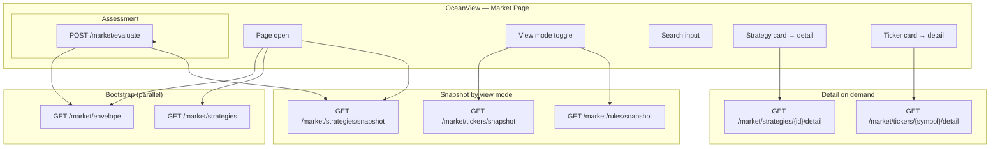

# Market Page

Strategy evaluation workspace — browse signals **by strategy**, **by ticker**, or **by rule**, run historical or live **Assess**, and open detail modals per strategy or ticker.

## Contents

- [APIs used by this page](#apis-used-by-this-page)
- [Scope](#scope)
- [UI → API overview](#ui--api-overview)
- [Page load sequence](#page-load-sequence)
- [View modes](#view-modes)
- [Controls](#controls)
- [UI components](#ui-components)
- [Summary strip](#summary-strip)
- [Detail modals](#detail-modals)
- [Empty states and errors](#empty-states-and-errors)
- [Troubleshooting](#troubleshooting)
- [Environment flags](#environment-flags)
- [Source file map](#source-file-map)
- [Known behavior (production)](#known-behavior-production)
- [Manual test checklist](#manual-test-checklist)
- [Related docs](#related-docs)

**Routes:**

| Route | Purpose |
|-------|---------|
| `/market` | Redirects to last-used view mode (localStorage) or `/market/strategies` |
| `/market/strategies` | Strategy thumbnail grid |
| `/market/tickers` | Ticker thumbnail grid |
| `/market/rules` | Rule thumbnail grid |

**UI title:** Market  
**Default home:** `/` redirects to `/market`.

**Related repos:**

| Repo | Role |
|------|------|
| `OceanView` | React UI — this page |
| `OceanView-API` | API Gateway + Python Lambdas — `market/*` |
| `FinanceAI` | Reference eval logic — ported into OceanView-API |

**Production URLs:** [aws-urls.md](./aws-urls.md)  
**Backend implementation:** `OceanView-API/docs/market-plan.md`

**Integration status:** Live API is wired. Production builds use `VITE_USE_MOCK_MARKET=false`. Dev defaults to mock JSON unless overridden in `.env.development.local`.

---

## APIs used by this page

Base path: `{VITE_API_BASE_URL}/market/...` — production uses `/api/market/...` (CloudFront → API Gateway). Types live in `src/features/market/types.ts`; HTTP client in `src/features/market/api/market-client.ts`.

### Endpoint summary

| Method | Path | When the UI calls it | Wired |
|--------|------|----------------------|-------|
| `GET` | `/market/envelope` | Page load (bootstrap, parallel with catalog) | Yes |
| `GET` | `/market/strategies` | Page load (strategy + rule catalog) | Yes |
| `GET` | `/market/strategies/snapshot` | After bootstrap; view mode **By strategy**; after Assess | Yes |
| `GET` | `/market/tickers/snapshot` | View mode **By ticker**; after Assess | Yes |
| `GET` | `/market/rules/snapshot` | View mode **By rule**; after Assess | Yes |
| `GET` | `/market/strategies/{strategyId}/detail` | Strategy detail modal open | Yes |
| `GET` | `/market/tickers/{symbol}/detail` | Ticker detail modal open | Yes |
| `POST` | `/market/evaluate` | **Assess** button | Yes |
| `GET` | `/market/envelope` | After Assess (refresh metadata) | Yes |
| `GET` | `/market/evaluate/{runId}` | — | No (client exists; sync assess only today) |
| `GET` | `/market/rules/{ruleKey}/detail` | — | No (v2 rule modal) |

**Snapshot/detail query:** optional `?runId=` from envelope. Omit `runId` when envelope has none — API returns fixture preview or latest persisted run.

**Mock mode:** snapshot from `/data/market-snapshot.json`; catalog tries `GET /market/strategies` first, then falls back to `/data/strategies.json` (sync from API — see [Strategy catalog](#strategy-catalog-source-of-truth)).

### Bootstrap — `GET /market/envelope`

| Field | UI use |
|-------|--------|
| `runId` | Persisted assessment id (`null` before first Assess) |
| `evaluatedAt`, `simulationTimeEt` | Summary strip / last run time |
| `tradeDate` | Session date |
| `signalThresholdPct` | Signal badge threshold (default 50) |
| `catalogVersion` | Catalog cache version |
| `status` | `complete` \| `running` \| `failed` \| `stale` |
| `candleCoverage` | Assessment datetime min/max (`earliestAt`, `latestAt`, `timezone`) |
| `summary.strategyCount` | Summary strip |
| `summary.tickerCount` | Summary strip |
| `summary.activeSignals` | Summary strip |
| `summary.ruleCount` | Summary strip (rules mode) |

### Catalog — `GET /market/strategies`

Returns `{ version, updatedAt, strategies[] }`. Each strategy: `id`, `name`, `shortName?`, `description`, `entryWindow?`, `active`, `rules[]` (`ruleKey`, `label`, `type`, `timeframe?`).

Only strategies with **`active: true`** appear in Market grids, rule cards, and Assess. Inactive playbook entries stay in the JSON for reference but are hidden in the UI. See [Strategy catalog](#strategy-catalog-source-of-truth).

**Entry window:** On Assess (Live “now” or Simulate ET time), strategies with a structured `entryWindow` are included only when that clock falls inside `startEt`–`endEt`. Strategies outside the window are omitted from scoring (not shown as pending / out-of-window rows).
### Snapshots — `GET /market/{mode}/snapshot`

Response shape: `{ runId, items[] }`.

| Mode | Key `items[]` fields |
|------|----------------------|
| strategies | `strategyId`, `name`, `signalCount`, `previewTickers[]` (`symbol`, `qualityPct`, `achievedAtEt?`) |
| tickers | `symbol`, `name`, `signalCount`, `bestSignal`, `topStrategyEval` |
| rules | `ruleKey`, `label`, `type`, `strategyId`, `strategyName`, `metCount`, `totalSymbols`, `previewSymbols[]` |

UI merges strategy snapshots with **active** catalog rows via `adaptStrategySnapshotItems` (inactive strategies omitted; missing snapshot rows get `signalCount: 0`).

### Detail — on modal open

| Endpoint | Response |
|----------|----------|
| `GET /market/strategies/{id}/detail` | `{ strategy, runId, rows[] }` — per-ticker quality, direction, rule statuses |
| `GET /market/tickers/{symbol}/detail` | `{ symbol, name, runId, strategies[] }` — per-strategy eval + rules |

### Assess — `POST /market/evaluate`

**Request** (UI sends):

```json
{
  "simulationTimeEt": "2026-06-26T10:30:00-04:00",
  "options": { "signalThresholdPct": 50 }
}
```

Omit `symbols` → API evaluates all **active** tickers. Omit `strategyIds` → all **active** strategies.

Optional body fields (UI does not send today unless extended):

| Field | Purpose |
|-------|---------|
| `symbols` | Restrict eval to listed tickers |
| `strategyIds` | Restrict eval to listed strategies |
| `tradeDate` | Session date override (`YYYY-MM-DD`) |
| `options.includeExtraRules` | Include `extra` rules in counts |

**Response:** `{ runId, status, ... }` — UI re-fetches envelope + active view snapshot.

During regular session (Mon–Fri 9:30 AM – 4:00 PM ET), when `simulationTimeEt` is today, the API may refresh candles incrementally before scoring — no separate Admin candle refresh required for Assess during the session.

**Assess UX:** button and datetime are disabled while pending; Schwab refresh + eval can take **10–30 seconds** per small universe. With more than ~5 symbols the API may return `202` async — UI does not poll yet (`fetchEvaluateStatus` exists for future use).

**Error codes** (HTTP 400/409, body `{ error, code }`):

| Code | User message |
|------|----------------|
| `MARKET_EVAL_OUT_OF_COVERAGE` | Assessment time is outside available candle history. |
| `MARKET_EVAL_CONFLICT` | Another assessment is already running. |
| `MARKET_NO_CANDLES` | No candle data — try again during market hours. |
| `MARKET_INVALID_SYMBOL` | Invalid symbol or empty ticker catalog. |

### Rule status values (eval + detail)

| `status` | Meaning |
|----------|---------|
| `met` | Rule passed |
| `partial` | Near / partial |
| `not_met` | Not met |
| `pending` | Not yet evaluable at assessment time |
| `about_to_cross` | About to cross BB mid |

**Signal:** `qualityPct >= signalThresholdPct` counts as a signal for badges and summary.

### HTTP client (`market-client.ts`)

| Function | HTTP |
|----------|------|
| `fetchMarketEnvelope()` | `GET /market/envelope` |
| `fetchStrategiesCatalog()` | `GET /market/strategies` |
| `fetchStrategiesSnapshot(runId?)` | `GET /market/strategies/snapshot?runId=` |
| `fetchTickersSnapshot(runId?)` | `GET /market/tickers/snapshot?runId=` |
| `fetchRulesSnapshot(runId?)` | `GET /market/rules/snapshot?runId=` |
| `fetchStrategyDetail(id, runId?)` | `GET /market/strategies/{id}/detail?runId=` |
| `fetchTickerDetail(symbol, runId?)` | `GET /market/tickers/{symbol}/detail?runId=` |
| `postMarketEvaluate(body)` | `POST /market/evaluate` |
| `fetchEvaluateStatus(runId)` | `GET /market/evaluate/{runId}` (not used in UI loop yet) |

### Backend architecture (summary)

OceanView-API runs **evaluate once, serve many views**:

```
candles → foundation → rule checks → strategy assess → persist run (runId)
                                              ↓
                    envelope / snapshots / detail endpoints (projections)
```

The UI never downloads the full canonical `results[]` tree on page load. Grids use snapshot endpoints; modals fetch detail on demand. Full pipeline details: `OceanView-API/docs/market-plan.md`.

### Eval universe (indirect dependency)

Market does not call `GET /tickers` directly. Assess uses **active symbols** from `OceanView-Tickers` and **active strategies** from the market catalog (`GET /market/strategies`, `active: true`). Manage tickers in Admin ([candles-pane.md](./candles-pane.md)).

### Strategy catalog (source of truth)

| Item | Location |
|------|----------|
| **Canonical JSON** | `OceanView-API/data/strategies.json` |
| **Served by API** | `GET /market/strategies` |
| **Mock fallback (UI)** | `OceanView/data/strategies.json` — copy of API file for offline mock |

**To change which strategies appear on Market:**

1. Edit `active: true/false` on each strategy in **`OceanView-API/data/strategies.json`** (today: `estrategia-01` and `estrategia-05` only).
2. Redeploy or restart SAM (`sam build` + `sam local start-api`) so the API loads the file.
3. For mock UI without API, sync the copy: `.\scripts\sync-strategies-catalog.ps1` from the OceanView repo root.

Grids, rule cards, envelope `summary.strategyCount`, and Assess all use **active-only** strategies. Full playbook entries remain in JSON with `active: false` for future use. See `OceanView-API/docs/strategies-and-rules.md`.

---

## Scope

### In scope

- Three view modes (strategies / tickers / rules) with client-side search
- Summary strip (strategy count, active signals, ticker count, rules, assessment label)
- Assessment time picker bounded by candle coverage + **Assess** action
- Thumbnail grids with signal badges and preview rows
- Strategy and ticker **detail modals** (rule status strips, per-symbol rows)
- Live API mode (`VITE_USE_MOCK_MARKET=false`) and mock fixture mode (`true`)

### Out of scope (v1)

- Rule-card detail modal (`GET /market/rules/{ruleKey}/detail` — not wired)
- Async assess polling for large batches (`GET /market/evaluate/{runId}` — client exists, not used in UI loop)
- Admin candle refresh from Market (use [candles-pane.md](./candles-pane.md))
- Cognito auth on Market routes

---

## UI → API overview

Production calls same-origin `/api/market/*` (CloudFront → API Gateway). Local dev uses Vite proxy or SAM on `:3001`.



**No client-side polling** after Assess. The UI waits for `POST /market/evaluate` to complete, then re-fetches envelope + the active view snapshot.

---

## Page load sequence

### Live mode (`VITE_USE_MOCK_MARKET=false`)

1. **Bootstrap** — parallel `GET /market/envelope` + `GET /market/strategies`
   - Sets catalog, envelope, `runId` from envelope (may be `null` before first Assess)
   - Initializes assessment time from `envelope.candleCoverage`
2. **Snapshot** — `GET /market/{mode}/snapshot` with optional `?runId=`
   - Runs after catalog is loaded, **even when envelope `runId` is null**
   - Without `runId`, API returns fixture preview or latest persisted run (see OceanView-API `MARKET_ASSESSMENT_FIXTURE_FALLBACK`)
   - Snapshot is cached per view mode; switching modes fetches once per mode
3. **Grids** — card models built via `adapt*SnapshotItems` (live) or `build*Cards` (mock)

### Mock mode (`VITE_USE_MOCK_MARKET=true`)

1. Loads static JSON from `/data/strategies.json` + `/data/market-snapshot.json`
2. Builds all three grids client-side from full snapshot (no API)
3. Assess is simulated locally (400 ms delay, updates assessment label only)

---

## View modes

| Mode | Route | Snapshot endpoint | Grid component | Search fields |
|------|-------|-------------------|----------------|---------------|
| By strategy | `/market/strategies` | `/market/strategies/snapshot` | `StrategyCard` | strategy name, id |
| By ticker | `/market/tickers` | `/market/tickers/snapshot` | `TickerCard` | symbol, name |
| By rule | `/market/rules` | `/market/rules/snapshot` | `RuleCard` | rule label, ruleKey, strategy name |

Last-selected mode is stored in `localStorage` key `oceanview.market.viewMode`.

---

## Controls

| UI control | Behavior |
|------------|----------|
| **View toggle** | Navigates `/market/{mode}`; persists mode to localStorage |
| **Search** | Client-side filter on active grid; empty search shows all cards |
| **Assessment datetime** | Eastern `datetime-local` input; min/max from candle coverage |
| **Now** | Sets time to latest coverage bound (live “now” within available candles) |
| **Assess** | Validates time in coverage → `POST /market/evaluate` → refresh envelope + snapshot |

### Signal threshold

Default **50%** (`signalThresholdPct` from envelope or mock snapshot). A ticker/strategy pair counts as a **signal** when `qualityPct >= threshold`.

---

## Summary strip

`MarketSummaryStrip` shows:

- Active strategy count (from envelope summary in live mode; full catalog in mock)
- Active signals (cross `(symbol, strategy)` above threshold)
- Ticker count
- Rule count (when available)
- Assessment label — `Live …` or `Assessed …` (ET display)

---

## Detail modals

| Modal | Trigger | Live data source | Mock data source |
|-------|---------|------------------|------------------|
| `StrategyDetailModal` | “View detail” on strategy card | `GET /market/strategies/{id}/detail?runId=` | Rows from mock snapshot via `tickersForStrategy` |
| `TickerDetailModal` | Click ticker card | `GET /market/tickers/{symbol}/detail?runId=` | Mock snapshot ticker row |

Both show rule check strips, quality badges, and expandable rule requirement lists.

---

## UI components

| Component | Role |
|-----------|------|
| `MarketViewToggle` | Switch strategies / tickers / rules |
| `MarketSearchInput` | Client-side grid filter |
| `MarketSummaryStrip` | Counts + assessment label under page title |
| `AssessmentTimeControl` | ET datetime, Now, Assess |
| `StrategyCard` | Strategy grid tile + “View detail” |
| `TickerCard` | Ticker grid tile; rule icon strip from `topStrategyEval` |
| `RuleCard` | Rule grid tile (no detail modal in v1) |
| `StrategyDetailModal` | Full ticker table for one strategy |
| `TickerDetailModal` | Per-strategy accordion for one symbol |
| `RuleCheckStrip` / `RuleCheckIcon` | Rule status icons on cards, Best-result thumbnails, and modals — **required first**, then **bonus** (`extra`) with a smaller glyph |
| `RuleRequirementsList` | Expanded rule rows in modals (same required→bonus order) |

State and data loading live in `useMarketWorkspace` (`src/features/market/hooks/useMarketWorkspace.ts`).

**Navigation cache (stale-while-revalidate):** Leaving Market unmounts the page, but bootstrap (envelope + strategies catalog) and per-mode snapshot cards are kept in a module cache (`market-workspace-cache.ts`). Returning to Market shows the last good grids immediately and refreshes in the background. Snapshot loads no longer blank the UI when that mode already has cached cards. Cache clears after a new Assess.

---

## Empty states and errors

| Condition | UI message |
|-----------|------------|
| Loading bootstrap or snapshot (no cached data yet) | “Loading market data…” |
| Bootstrap/snapshot HTTP failure | Red error banner with message |
| Envelope `runId === null` (live, no persisted run) | Banner: “No assessment run yet. Click **Assess**…” (hidden while snapshot is loading) |
| Search with no matches | “No {strategies\|tickers\|rules} match your search.” |
| Search empty, grid empty | No misleading search message (banner or loading/error only) |

---

## Troubleshooting

| Symptom | Likely cause | What to check |
|---------|--------------|---------------|
| “Unexpected Application Error! 404 Not Found” | Unknown URL (no matching route) | Use `/market/strategies`, `/market/tickers`, `/admin`; deploy must include `RouteNotFound` catch-all |
| Empty strategy grid, no error | Was: snapshot not fetched when `envelope.runId` is null (fixed in UI) | Deploy latest UI; confirm `GET /market/strategies/snapshot` returns items |
| “No assessment run yet” banner | No persisted Assess run (`runId: null`) | Expected until **Assess**; banner can show alongside fixture preview cards |
| Assess button seems to do nothing (local) | Mock mode (`VITE_USE_MOCK_MARKET=true`) only updates the time label | Use `npm run dev:local` (sets live Market API); or read the mock notice under Assess |
| Assess fails locally | Stale SAM on `:3001` (health OK but `/market/*` → 403) | Stop API window, `sam build`, restart API, then `npm run dev:local` |
| Red error on load | API unreachable or 5xx | [aws-urls.md](./aws-urls.md) smoke tests; CloudFront `/api/*` origin |
| Mock data in production | Stale build with `VITE_USE_MOCK_MARKET=true` | `.env.production` must be `false`; redeploy via GitHub Actions |
| Assess hangs then fails | Schwab / Dynamo / eval timeout | API logs in CloudWatch; try one active ticker first |

**Production smoke test:**

```powershell
$ui = "https://d1xsxf8zu41xgt.cloudfront.net"
curl.exe "$ui/api/market/envelope"
curl.exe "$ui/api/market/strategies/snapshot"
```

---

## Environment flags

| Variable | Dev default | Production | Purpose |
|----------|-------------|------------|---------|
| `VITE_USE_MOCK_MARKET` | `true` (`.env.development`) | `false` (`.env.production`) | Mock JSON vs live API |
| `VITE_API_BASE_URL` | `/api` | `/api` | Base path for market client |

See [environment.md](./environment.md).

### Local dev (live API)

```powershell
# From OceanView repo — starts SAM API + Vite with proxy
npm run dev:local
```

Or manually: SAM on `:3001`, then `VITE_USE_MOCK_MARKET=false` and `VITE_DEV_API_PROXY_TARGET=http://127.0.0.1:3001` in `.env.development.local`. See [cursor-rules-skills.md](./cursor-rules-skills.md) (`oceanview-dev-local` skill).

**Verify:**

```powershell
curl.exe http://127.0.0.1:3001/market/envelope
curl.exe http://127.0.0.1:5173/api/market/envelope   # via Vite proxy
```

Open http://localhost:5173/market/strategies — grids should load from API when mock flag is off.

---

## Source file map

| Path | Role |
|------|------|
| `src/features/market/MarketPage.tsx` | Page layout (full-width main column), grids, banners |
| `src/features/market/MarketRedirect.tsx` | `/market` → stored mode |
| `src/features/market/hooks/useMarketWorkspace.ts` | Load, assess, search, snapshot cache |
| `src/features/market/api/market-workspace-cache.ts` | Session cache across Market remounts |
| `src/features/market/api/market-client.ts` | HTTP client, error types |
| `src/features/market/api/market-data.ts` | Bootstrap, mock loaders, snapshot by mode |
| `src/features/market/api/adapters.ts` | API snapshot items → card models |
| `src/features/market/display.ts` | Mock card builders, badges, rule merge |
| `src/features/market/types.ts` | Catalog, envelope, card, detail types |
| `src/features/market/lib/catalog.ts` | Active strategy filter (matches API) |
| `src/features/market/lib/market-routes.ts` | Routes + localStorage mode |
| `src/features/market/lib/assessment-time.ts` | ET parsing, coverage validation |
| `src/features/market/components/*` | Cards, modals, controls, summary |
| `src/app/router.tsx` | Route registration |
| `data/strategies.json` | Mock catalog fallback (sync from API) |
| `data/market-snapshot.json` | Mock eval snapshot |
| `scripts/sync-strategies-catalog.ps1` | Copy catalog from `OceanView-API/data/strategies.json` |

---

## Known behavior (production)

- **`runId: null` in envelope** — Normal before the first Assess. Snapshot endpoints still respond; grids show fixture preview data while the “No assessment run yet” banner remains until a real run persists `runId`.
- **Fixture fallback** — Controlled in OceanView-API (`MARKET_ASSESSMENT_FIXTURE_FALLBACK`, default on). Disable in production when only real persisted runs should appear.
- **Candles prerequisite** — Assess needs candle data for active tickers. Refresh candles in Admin first if `MARKET_NO_CANDLES` appears.
- **Mock fixtures** — `data/market-snapshot.json` for offline eval preview; catalog prefers live `GET /market/strategies`, with `data/strategies.json` as fallback (run `scripts/sync-strategies-catalog.ps1` after API catalog changes).

---

## Manual test checklist

### Bootstrap

- [ ] `/market/strategies` loads with `VITE_USE_MOCK_MARKET=false` (no static snapshot JSON)
- [ ] Envelope shows candle coverage window on assessment control
- [ ] Catalog lists **active** strategies only in grids (count matches envelope `summary.strategyCount`)
- [ ] Grids show snapshot data even when envelope `runId` is null (fixture preview)

### Assess

- [ ] Assess at “now” during session completes and updates summary strip
- [ ] Historical time within coverage works off-hours
- [ ] Time outside coverage shows validation error before POST
- [ ] Double Assess while running → `MARKET_EVAL_CONFLICT` message

### Detail

- [ ] Strategy detail modal loads rule rows with correct statuses
- [ ] Ticker detail shows per-strategy accordion

### Mock fallback

- [ ] `VITE_USE_MOCK_MARKET=true` loads `/data/*.json` with no API calls

---

## Related docs

| Doc | Purpose |
|-----|---------|
| [README.md](./README.md) | Documentation index |
| [aws-urls.md](./aws-urls.md) | Production URLs and smoke tests |
| [candles-pane.md](./candles-pane.md) | Admin candle intake (feeds Assess) |
| [environment.md](./environment.md) | `VITE_*` flags and local proxy |
| [cursor-rules-skills.md](./cursor-rules-skills.md) | Local dev skill (`oceanview-dev-local`) |
| `OceanView-API/docs/market-plan.md` | Backend pipeline and Lambda routes |
