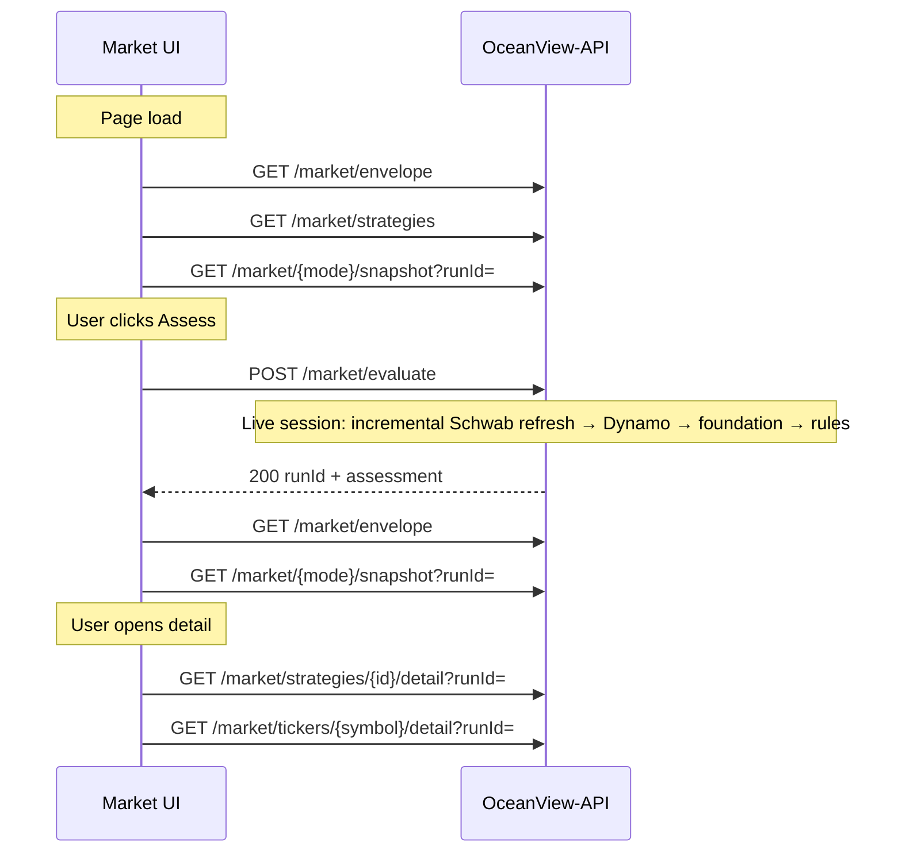

# Market UI — live API integration (next steps)

**Status:** UI uses mock JSON. OceanView-API Market module is implemented and ready to wire.

**Related:**

| Doc | Role |
|-----|------|
| [market-api-contract.md](./market-api-contract.md) | Full DTO shapes and field glossary |
| [market-backend-plan.md](./market-backend-plan.md) | Backend architecture (evaluate once, project many) |
| [environment.md](./environment.md) | `VITE_*` vars and local proxy |
| [OceanView-API/docs/market-assess-walkthrough.md](https://github.com/mlsloynaz/OceanView-API/blob/main/docs/market-assess-walkthrough.md) | Assess pipeline, candle refresh behavior |

---

## Current state

### UI (this repo)

| Piece | Today |
|-------|--------|
| `src/features/market/api/market-data.ts` | Loads `/data/strategies.json` + `/data/market-snapshot.json` |
| `useMarketWorkspace.ts` | Builds grid cards client-side via `display.ts` |
| **Assess** button | Mock `setTimeout(400)` — no API call |
| Detail modals | Read from in-memory `snapshot.results[]` |
| Feature flag | None (`marketDataUsesMock()` always `true`) |

### API (OceanView-API)

| Piece | Status |
|-------|--------|
| `GET /market/envelope` | Coverage, last `runId`, summary |
| `GET /market/strategies` | Strategy + rule catalog |
| `GET /market/strategies/snapshot` | Strategy grid DTO |
| `GET /market/tickers/snapshot` | Ticker grid DTO |
| `GET /market/rules/snapshot` | Rule grid DTO |
| `GET /market/strategies/{id}/detail` | Strategy modal payload |
| `GET /market/tickers/{symbol}/detail` | Ticker modal payload |
| `POST /market/evaluate` | Assess (includes incremental candle refresh during regular session) |
| `GET /market/evaluate/{runId}` | Poll job status |

**Catalog today:** only **AAPL** is active in `OceanView-Tickers`. Strategies **estrategia-01** and **estrategia-05** are active in the API catalog.

---

## Target behavior



**Assess is one step in the UI.** During Mon–Fri 9:30 AM – 4:00 PM ET, when `simulationTimeEt` is today, the API refreshes candles incrementally before scoring. No separate Admin candle refresh is required for Assess during the session.

---

## Phase 1 — API client + feature flag (~0.5 day)

### 1.1 Environment

Add to `.env.example`, `.env.development`, `.env.production`, and `src/vite-env.d.ts`:

```env
VITE_USE_MOCK_MARKET=true
```

| Value | Behavior |
|-------|----------|
| `true` | Keep current mock JSON (default until integration is tested) |
| `false` | Call OceanView-API via `VITE_API_BASE_URL` |

Document in [environment.md](./environment.md).

### 1.2 Create `market-client.ts`

**Path:** `src/features/market/api/market-client.ts`

Follow the same pattern as `src/features/admin/candles/api/candles-client.ts`:

- `API_BASE` from `VITE_API_BASE_URL` (default `/api`)
- `USE_MOCK` from `VITE_USE_MOCK_MARKET`
- Shared `fetchJson<T>(path, init?)` with error parsing (`error`, `code` fields)
- Export typed functions:

| Function | HTTP |
|----------|------|
| `fetchMarketEnvelope()` | `GET /market/envelope` |
| `fetchStrategiesCatalog()` | `GET /market/strategies` |
| `fetchStrategiesSnapshot(runId?)` | `GET /market/strategies/snapshot?runId=` |
| `fetchTickersSnapshot(runId?)` | `GET /market/tickers/snapshot?runId=` |
| `fetchRulesSnapshot(runId?)` | `GET /market/rules/snapshot?runId=` |
| `fetchStrategyDetail(strategyId, runId?)` | `GET /market/strategies/{id}/detail?runId=` |
| `fetchTickerDetail(symbol, runId?)` | `GET /market/tickers/{symbol}/detail?runId=` |
| `postMarketEvaluate(body)` | `POST /market/evaluate` |
| `fetchEvaluateStatus(runId)` | `GET /market/evaluate/{runId}` |

### 1.3 Thin wrapper in `market-data.ts`

Keep `loadMarketWorkspaceData()` as the public entry but branch:

```ts
if (USE_MOCK) {
  // existing static JSON
}
return loadMarketWorkspaceFromApi();
```

---

## Phase 2 — Page bootstrap (~1 day)

### 2.1 Replace monolithic snapshot load

**Remove dependency on** `data/market-snapshot.json` for live mode.

On mount, `useMarketWorkspace` should:

1. `GET /market/envelope` → store `runId`, `candleCoverage`, `signalThresholdPct`, `evaluatedAt`, `summary`
2. `GET /market/strategies` → store catalog (includes `active` per strategy)
3. Load snapshot for current view mode using `runId` from envelope (skip if `runId` is null — empty grids, prompt user to Assess)

### 2.2 Coverage for Assess time control

Today coverage comes from `snapshot.candleCoverage`. Live mode:

- Source: `envelope.candleCoverage` (`earliestAt`, `latestAt`, `timezone`)
- Keep existing `validateAssessmentTime()` / `coverageBoundsForInput()` — shapes match `CandleCoverage` in `types.ts`

### 2.3 Summary strip

`MarketSummaryStrip` should use envelope fields:

| UI label | Envelope field |
|----------|----------------|
| Active signals | `summary.activeSignals` |
| Tickers | `summary.tickerCount` |
| Strategies | `summary.strategyCount` |
| Rules | `summary.ruleCount` |
| Last run | `evaluatedAt` + `runId` |

---

## Phase 3 — Grid snapshots (~1 day)

API snapshot endpoints return `{ runId, items: [...] }`. UI card models today embed full catalog objects — add **adapters** in `display.ts` or a new `adapters.ts`:

### Strategy grid

API item:

```json
{
  "strategyId": "estrategia-01",
  "name": "Hourly Trend Change",
  "signalCount": 0,
  "previewTickers": [{ "symbol": "AAPL", "qualityPct": 72 }]
}
```

Map to `StrategyCardModel`:

```ts
{
  strategy: catalogById[strategyId], // from GET /market/strategies
  signalCount,
  previewTickers,
}
```

Filter catalog to strategies present in snapshot **or** show all catalog rows with `signalCount: 0` (match mock behavior).

### Ticker grid

API item matches `TickerCardModel` closely (`symbol`, `name`, `signalCount`, `bestSignal`, `topStrategyEval`). Minor field alignment only.

### Rule grid

API item matches `RuleCardModel` (`ruleKey`, `label`, `type`, `strategyId`, `strategyName`, `metCount`, `previewSymbols`). Join `type` / `timeframe` from catalog rules if missing.

### Refetch on view mode change

When user switches `/market/strategies` ↔ `/market/tickers` ↔ `/market/rules`, fetch the matching snapshot (same `runId`). Cache per `(runId, mode)` in hook state to avoid duplicate calls.

---

## Phase 4 — Assess button (~0.5 day)

Replace mock timeout in `runAssessment`:

```ts
const body = {
  simulationTimeEt: assessmentAt.toISOString(), // or ET offset string
  // omit symbols → API uses all active tickers (AAPL only for now)
  options: { signalThresholdPct: threshold },
};

const { runId, assessment } = await postMarketEvaluate(body);
```

### UX

| State | UI |
|-------|-----|
| Pending | Disable Assess + datetime; show spinner (Schwab refresh + eval can take 10–30s for one symbol) |
| Success | Update `runId`, re-fetch envelope + active snapshot; set `lastAssessedAt` |
| Error | Map `code` to user message (see below) |

### Error codes

| `code` | HTTP | User message (suggested) |
|--------|------|--------------------------|
| `MARKET_EVAL_OUT_OF_COVERAGE` | 400 | Assessment time is outside available candle history |
| `MARKET_EVAL_CONFLICT` | 409 | Another assessment is already running |
| `MARKET_NO_CANDLES` | 400 | No candle data — try again during market hours |
| `MARKET_INVALID_SYMBOL` | 400 | Invalid symbol or empty catalog |

### Async (later)

Sync limit is **5 symbols** today. With AAPL-only catalog, always sync `200`. When universe grows, handle `202` + poll `GET /market/evaluate/{runId}` (same pattern as candles job polling if added).

---

## Phase 5 — Detail modals (~1 day)

Today modals receive `snapshot: MarketSnapshotFile` and slice client-side.

Live mode — fetch on open:

| Modal | Endpoint |
|-------|----------|
| `StrategyDetailModal` | `GET /market/strategies/{strategyId}/detail?runId=` |
| `TickerDetailModal` | `GET /market/tickers/{symbol}/detail?runId=` |

### Props refactor

```ts
// Before
<StrategyDetailModal strategy={...} snapshot={snapshot} onClose={...} />

// After (live)
<StrategyDetailModal strategy={...} runId={runId} onClose={...} />
```

Modal loads detail internally (loading / error states). Response already includes merged rule labels + ticker rows — reuse `RuleCheckStrip`, `mergeRuleDisplay` where shapes match `RuleEval`.

---

## Phase 6 — Polish + production (~0.5 day)

- [ ] Empty state when `envelope.runId === null` (“Run Assess to evaluate active tickers”)
- [ ] Show `envelope.status` (`complete` | `running` | `stale`) in summary strip
- [ ] `marketDataUsesMock()` → read `VITE_USE_MOCK_MARKET`
- [ ] Update [plan.md](./plan.md) Market row — mark UI integration in progress
- [ ] Manual test checklist (below)
- [ ] Set `VITE_USE_MOCK_MARKET=false` in `.env.production` when ready

---

## Local dev setup

```powershell
# Terminal 1 — API
cd C:\Code\OceanView-API
.\scripts\sam.ps1 local start-api -p 3001

# Terminal 2 — UI
cd C:\Code\OceanView
# .env.development.local
# VITE_USE_MOCK_MARKET=false
# VITE_DEV_API_PROXY_TARGET=http://127.0.0.1:3001
npm run dev
```

Or: `npm run dev:local` if the script sets the proxy.

Verify proxy: `curl http://127.0.0.1:5173/api/market/envelope` (via Vite) or hit `:3001/market/envelope` directly.

---

## Manual test checklist

### Bootstrap

- [ ] `/market/strategies` loads without mock JSON when `VITE_USE_MOCK_MARKET=false`
- [ ] Envelope shows candle coverage window
- [ ] Catalog lists strategies from API (E01, E05 active)
- [ ] Grids empty or show last persisted run when `runId` present

### Assess (market hours)

- [ ] Assess at “now” completes (may take 15–30s — Schwab + eval)
- [ ] AAPL appears in ticker grid after assess
- [ ] Summary strip updates signal counts
- [ ] No Admin candle refresh required before Assess

### Assess (off-hours / historical)

- [ ] Selecting a historical time within coverage works without Schwab refresh
- [ ] Time outside coverage shows validation error before POST

### Detail

- [ ] Strategy detail modal loads rule rows with correct statuses
- [ ] Ticker detail accordion shows per-strategy eval

### Errors

- [ ] Double-click Assess while running → `MARKET_EVAL_CONFLICT` handled
- [ ] Mock fallback still works with `VITE_USE_MOCK_MARKET=true`

---

## File change map

| File | Change |
|------|--------|
| `src/features/market/api/market-client.ts` | **New** — live HTTP client |
| `src/features/market/api/market-data.ts` | Mock vs live branch |
| `src/features/market/hooks/useMarketWorkspace.ts` | Envelope-first load, real assess, snapshot by mode |
| `src/features/market/types.ts` | Optional API envelope/snapshot response types |
| `src/features/market/display.ts` | Adapters API snapshot → card models |
| `src/features/market/components/StrategyDetailModal.tsx` | Fetch detail by `runId` |
| `src/features/market/components/TickerDetailModal.tsx` | Fetch detail by `runId` |
| `src/vite-env.d.ts` | `VITE_USE_MOCK_MARKET` |
| `.env.example` | Document flag |
| `docs/environment.md` | Document flag |

**Do not delete** `data/market-snapshot.json` or `data/strategies.json` until mock mode is retired — they remain the mock fixture source.

---

## Suggested PR order

1. **PR 1** — `market-client.ts` + env flag + tests (fetch mocks)
2. **PR 2** — Envelope + catalog bootstrap; grids still from mock snapshot (hybrid smoke)
3. **PR 3** — Snapshot endpoints + adapters for three view modes
4. **PR 4** — Live Assess + error handling
5. **PR 5** — Detail modals on demand; remove hybrid mock snapshot path
6. **PR 6** — Production flip `VITE_USE_MOCK_MARKET=false`

---

## Out of scope (v1)

- `GET /market/rules/{ruleKey}/detail` (rule card detail — v2)
- Async assess polling for >5 symbols
- Wiring `strategyHints` / foundation debug panel
- Cognito auth on Market routes
- Scheduled auto-assess (EventBridge)

---

## API reference (quick)

Base path: `{VITE_API_BASE_URL}` → `/api/market/...` in production (CloudFront → API Gateway).

| Method | Path |
|--------|------|
| GET | `/market/envelope` |
| GET | `/market/strategies` |
| GET | `/market/strategies/snapshot?runId=` |
| GET | `/market/tickers/snapshot?runId=` |
| GET | `/market/rules/snapshot?runId=` |
| GET | `/market/strategies/{strategyId}/detail?runId=` |
| GET | `/market/tickers/{symbol}/detail?runId=` |
| POST | `/market/evaluate` |
| GET | `/market/evaluate/{runId}` |

**POST /market/evaluate body:**

```json
{
  "symbols": ["AAPL"],
  "simulationTimeEt": "2026-06-26T10:30:00-04:00",
  "strategyIds": null,
  "options": { "signalThresholdPct": 50 }
}
```

Omit `symbols` to evaluate all active catalog tickers. Omit `strategyIds` to run all active strategies (E01 + E05).
