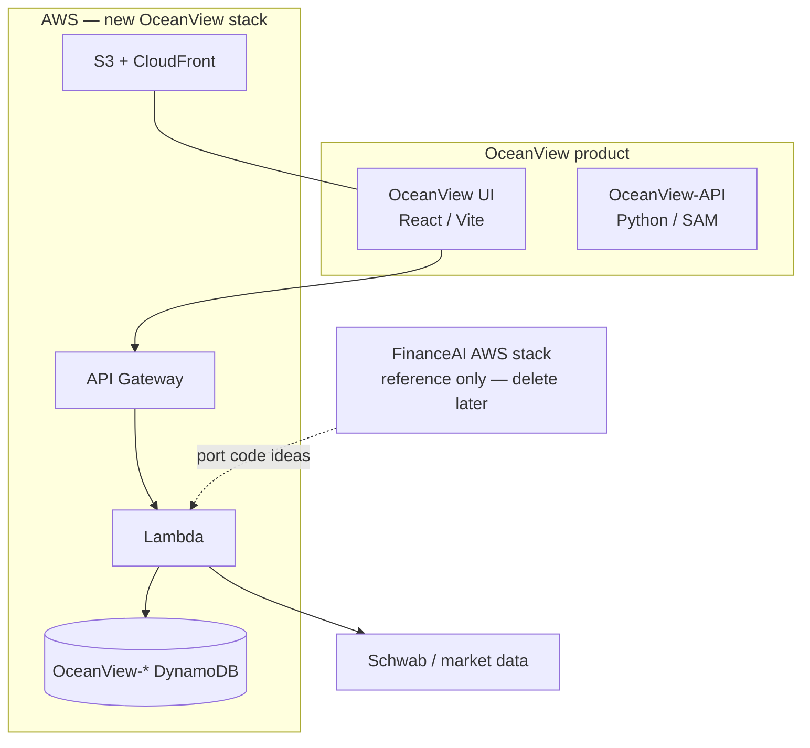
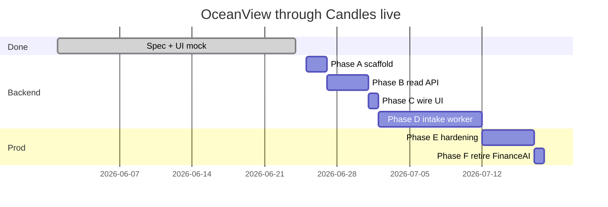

# OceanView — master plan (through Candles + OceanView-API)

Consolidated roadmap from decisions made so far. Use this as the **single checklist**; detail lives in linked docs.

| Document | Contents |
|----------|----------|
| [candles-pane.md](./candles-pane.md) | Candles UI, API contract, button → endpoint matrix, JSON shapes |
| [market-backend-plan.md](./market-backend-plan.md) | Market eval pipeline, snapshot/detail APIs, URL modes (plan only) |
| [market-api-contract.md](./market-api-contract.md) | Market field-level DTOs and endpoint inventory |
| [deploy-aws.md](./deploy-aws.md) | S3 + CloudFront + GitHub Actions deploy |
| [oceanview-api-setup.md](./oceanview-api-setup.md) | OceanView-API repo layout, SAM, DynamoDB, deploy steps |
| `src/features/admin/candles/types.ts` | TypeScript DTOs the API must match |

---

## 1. Goal

Replace InvestJournal **market operations** (starting with Admin candle intake) with an independent product:

**Principles (locked in):**

- English UI and API messages
- **No FinanceAI runtime** — no bridge, no shared DynamoDB, no FinanceAI API calls
- **No client-side polling** on Candles pane — user clicks **Refresh status** after jobs
- All `candles/*` requests include `{ "tickers": string[] }` from the UI
- FinanceAI repo = **reference** to port Python; delete **FinanceAI AWS stack** when OceanView owns the same capabilities

---

## 2. Repositories

| Repo | Path | Status | Role |
|------|------|--------|------|
| **OceanView** | `C:\Code\OceanView` | In progress | Admin **Candles** pane done (mock); Market placeholder |
| **OceanView-API** | `C:\Code\OceanView-API` | Not started | `GET /admin/tickers`, `POST /candles/*` |
| **FinanceAI** | `C:\Code\FinanceAI` | Reference | Bar intake, Schwab client — port, do not deploy against |
| **InvestJournal** | `C:\Code\InvestJournal` | Legacy | Retire when OceanView replaces its market/admin flows |

---

## 3. AWS resources (OceanView only)

Deploy a **new** SAM stack in `us-east-1` (same account OK):

| Resource | Name |
|----------|------|
| Stack | `oceanview-api-prod` (or `-dev`) |
| API Gateway | `OceanView-Api` |
| DynamoDB | `OceanView-Tickers` |
| DynamoDB | `OceanView-CandlesJobs` |
| DynamoDB | `OceanView-CandleContext` |
| Secrets | `oceanview/schwab`, etc. |
| UI (later) | S3 + CloudFront `oceanview-ui-prod` |

**Do not attach** to `FinanceAI-*` tables or FinanceAI API Gateway.

---

## 4. API surface (Candles v1)

| Method | Path | When | Response |
|--------|------|------|----------|
| `GET` | `/admin/tickers` | Panel open | Catalog |
| `POST` | `/candles/result` | Panel open | Last job + `symbols[].context` |
| `POST` | `/candles/status` | **Refresh status** | Live job + symbols |
| `POST` | `/candles/refresh` | **Refresh candles** / row | `202` acknowledgment |
| `POST` | `/candles/reset` | **Reset candles** (confirm) | `202` acknowledgment |

Full schemas: [candles-pane.md § API reference](./candles-pane.md).

---

## 5. Progress

### Done ✅

| # | Deliverable | Notes |
|---|-------------|-------|
| 0 | Product spec | `candles-pane.md`, `oceanview-api-setup.md`, this plan |
| 1 | Candles pane UI shell | `/admin`, collapsible, ocean theme |
| 2 | Candles pane behavior | Mock client, hooks, row refresh, reset confirm, **no polling** |
| — | Types + mock fixtures | Align with API contract |

### Not started ⬜

| # | Deliverable |
|---|-------------|
| 3 | OceanView-API repo + SAM scaffold + `GET /health` |
| 4 | DynamoDB tables + seed tickers |
| 5 | Read API: `admin/tickers`, `candles/result`, `candles/status` |
| 6 | Wire UI to live API (`VITE_API_BASE_URL`) |
| 7 | Write API: `candles/refresh`, `candles/reset` + async worker |
| 8 | Port bar intake from FinanceAI → OceanView worker |
| 9 | Production: UI deploy + CloudFront `/api/*` — [deploy-aws.md](./deploy-aws.md); Cognito later |
| 10 | Decommission FinanceAI AWS stack + InvestJournal market ops |

---

## 6. Execution phases (from here)

### Phase A — OceanView-API scaffold (you, ~1 day)

**Goal:** Empty backend deploys to AWS.

- [ ] Create `C:\Code\OceanView-API` repo (see [oceanview-api-setup.md §3–4](./oceanview-api-setup.md))
- [ ] `template.yaml`: API Gateway + one Lambda router + 3 DynamoDB tables
- [ ] `GET /health` → `{ "ok": true }`
- [ ] `sam build` && `sam deploy --guided`
- [ ] Save API URL for Phase C

**Exit:** `curl …/health` returns 200.

**Cursor prompt:**

> Scaffold `C:\Code\OceanView-API` per `OceanView/docs/oceanview-api-setup.md` Step A. New `OceanView-*` resources only. No FinanceAI dependency.

---

### Phase B — Catalog + read API (~2–3 days)

**Goal:** Admin pane can load real tickers and candle snapshot.

- [ ] `scripts/seed_tickers.py` → `OceanView-Tickers` (symbols from your list; favorites flag)
- [ ] `GET /admin/tickers`
- [ ] `POST /candles/result` — read last job from `OceanView-CandlesJobs` + context from `OceanView-CandleContext`
- [ ] `POST /candles/status` — same stores; support `job.status` running | idle | completed
- [ ] pytest for handlers + service; JSON matches `types.ts`
- [ ] Initial context rows can be empty/`missing` until Phase D worker runs

**Exit:** Postman/curl returns valid JSON for all three routes.

**Reference code to port (read-only):**

- `FinanceAI/src/application/ticker/bar_maintenance_result.py` — outcome/banner ideas
- `FinanceAI/src/infrastructure/repositories/ticker_repository.py` — context shape ideas

---

### Phase C — Wire OceanView UI (~0.5 day)

**Goal:** Admin pane uses live read paths.

- [ ] `.env.local`: `VITE_API_BASE_URL`, `VITE_USE_MOCK_CANDLES=false`
- [ ] Update `candles-client.ts` — fetch live + mock fallback
- [ ] Optional Vite proxy for local dev (see setup doc §10.3)
- [ ] Manual test: open Admin → banner + rows from API

**Exit:** All read paths work without mock.

---

### Phase D — Candle intake worker (~1–2 weeks)

**Goal:** Refresh and reset actually fetch OHLC and update DynamoDB.

- [ ] `POST /candles/refresh` → create job `running`, return `202`
- [ ] `POST /candles/reset` → same with `kind: reset`
- [ ] Async worker (Lambda Event invoke or SQS)
- [ ] Port intake from FinanceAI:
  - `application/ticker/bar_maintenance.py`
  - `application/ticker/refresh.py`
  - `infrastructure/integrations/schwab_data.py` (or your provider)
- [ ] Write `OceanView-CandleContext` per symbol; finalize job in `OceanView-CandlesJobs`
- [ ] UI flow: Refresh candles → message → user clicks **Refresh status** → updated rows

**Exit:** End-to-end refresh for one ticker in AWS; then all catalog tickers.

---

### Phase E — Production hardening (later)

- [ ] Cognito + API Gateway authorizer
- [ ] CloudFront: UI on `/`, API on `/api/*`
- [ ] EventBridge schedule for daily candle refresh (optional)
- [ ] Admin ticker CRUD UI (replace “coming soon” in empty catalog message)

**Exit:** Team uses hosted OceanView only.

---

### Phase F — Retire legacy

**Delete FinanceAI AWS stack when:**

- [ ] OceanView-API runs refresh, reset, status, result in prod
- [ ] OceanView UI is the only ops UI you use for candles
- [ ] Ticker catalog lives in `OceanView-Tickers`
- [ ] No cron/scripts still call FinanceAI API Gateway

**Then:**

- [ ] Delete FinanceAI CloudFormation stack
- [ ] Stop using InvestJournal `/market` for intake
- [ ] Archive `C:\Code\FinanceAI` repo locally if you want history

---

## 7. Timeline sketch (suggested order)

Adjust dates to your pace; **B → C → D** is the critical path.

---

## 8. What we are not doing (yet)

| Item | Reason |
|------|--------|
| Earning calendar | Out of Candles pane scope |
| Foundation / BB15 / strategy eval | Future Market panes |
| FinanceAI bridge | Explicitly rejected |
| UI polling | Explicitly rejected |
| MySQL / InvestJournal catalog | Replaced by `OceanView-Tickers` |
| Reusing FinanceAI DynamoDB | Blocks clean FinanceAI deletion |

---

## 9. Next action

**Start Phase A:** create `OceanView-API` and deploy `GET /health`.

Use [oceanview-api-setup.md](./oceanview-api-setup.md) as the how-to; use this file to track checkboxes.

When Phase A is done, run Phase B with:

> Implement Phase B per `OceanView/docs/plan.md` and `candles-pane.md`. OceanView DynamoDB only. Match `types.ts`.

---

## 10. Doc maintenance

When a phase completes, update:

- Checkboxes in **§5** and **§6** of this file
- Phase status in [candles-pane.md](./candles-pane.md) (UI phases)
- Any new endpoints in both `candles-pane.md` and `openapi/candles.yaml` (when created in OceanView-API)
