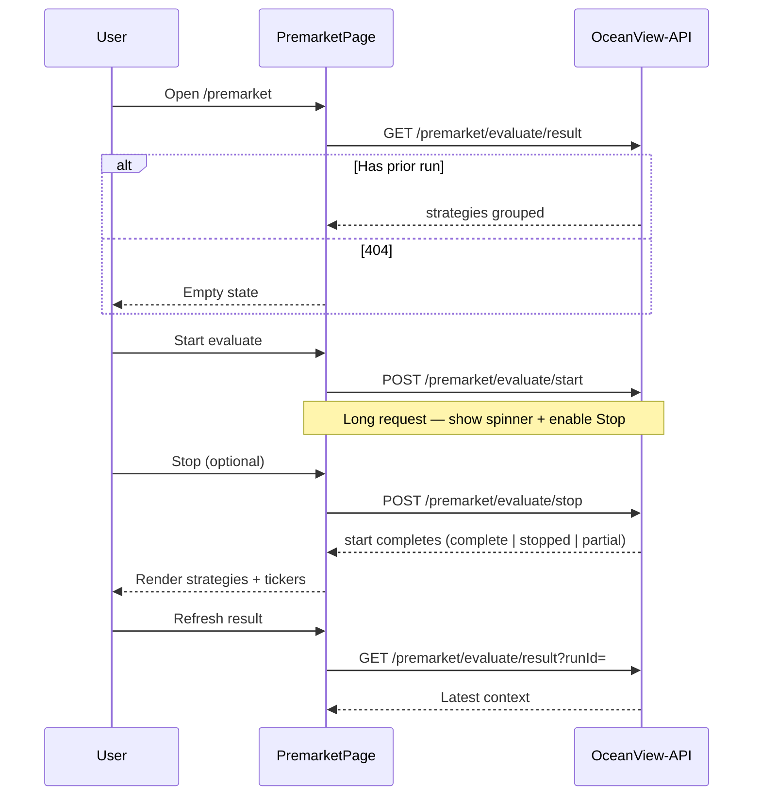

# Premarket Page — UI plan

Pre-open screening workspace — run **premarket evaluate** at **9:25 AM ET**, show tickers grouped by strategy where **quality ≥ 50%**, without updating Admin candle storage.

**Backend contract:** `OceanView-API/docs/premarket-evaluate.md`  
**Related UI docs:** [market-page.md](./market-page.md), [candles-pane.md](./candles-pane.md)

**Integration status:** **Implemented** — route `/premarket`, live API client, mock mode (`VITE_USE_MOCK_PREMARKET`).

---

## Contents

- [Goal](#goal)
- [Route and navigation](#route-and-navigation)
- [APIs to integrate](#apis-to-integrate)
- [UI → API flow](#ui--api-flow)
- [Page layout (wireframe)](#page-layout-wireframe)
- [State and hooks](#state-and-hooks)
- [Source file map (planned)](#source-file-map-planned)
- [Types and client](#types-and-client)
- [Mock mode](#mock-mode)
- [Error handling](#error-handling)
- [Differences from Market Assess](#differences-from-market-assess)
- [Implementation phases](#implementation-phases)
- [Manual test checklist](#manual-test-checklist)
- [Related docs](#related-docs)

---

## Goal

| User need | Solution |
|-----------|----------|
| Run pre-open scan before 9:30 | **Start evaluate** → API fetches extended-hours 15m (Schwab), assesses in memory |
| See candidates by strategy | Result view: **E01**, **E05**, … each with tickers + `qualityPct` |
| Stop a long run | **Stop** → API sets stop flag; partial results saved |
| Reload last run later | **Load result** → `GET /premarket/evaluate/result` |
| No surprise candle overwrites | UI copy: premarket **does not** update Admin candles |

**Not in scope (v1):**

- Auto-schedule at 9:25 (user clicks Start)
- Per-ticker or per-strategy filters (API evaluates all active tickers × active strategies)
- Polling `GET /jobs/status?jobType=premarket` (optional v2 — start is sync today)
- Detail modals reusing Market ticker/strategy detail (optional v2)

---

## Route and navigation

| Item | Proposal |
|------|------------|
| **Route** | `/premarket` |
| **Nav label** | **Premarket** (between Market and Admin in `TopNav`) |
| **Page title** | Premarket |
| **Subtitle** | Pre-open scan at 9:25 ET — live extended hours, no candle persist |

**Router** (`src/app/router.tsx`):

```tsx
{ path: "premarket", element: <PremarketPage /> }
```

**Why separate from Market?** Different intent (pre-open batch, strategy-first grouped output), different APIs, no assessment time picker / view modes / snapshots.

**Why not under Admin?** Admin is candle **storage** ops; premarket is **evaluation** (closer to Market mentally, but distinct enough for its own nav item).

---

## APIs to integrate

Base path: `{VITE_API_BASE_URL}/premarket/...` — production: `/api/premarket/...` via CloudFront.

| Method | Path | UI action | Sync? |
|--------|------|-----------|-------|
| `POST` | `/premarket/evaluate/start` | **Start evaluate** | Yes — wait for response (may take 10–60s+) |
| `POST` | `/premarket/evaluate/stop` | **Stop** (while start pending) | Yes — quick ack |
| `GET` | `/premarket/evaluate/result` | Page load + **Refresh result** | Yes |

Optional (v2): `GET /jobs/status?jobType=premarket` for progress if start becomes async.

### Start — request

```json
{
  "simulationTimeEt": "2026-06-29T09:25:00-04:00",
  "options": { "signalThresholdPct": 50 }
}
```

Empty body `{}` is valid (API defaults: today 9:25 ET, threshold 50).

### Start — response (use for immediate UI update)

Key fields: `runId`, `status`, `stopped`, `summary`, `strategies[]`.

### Result — response

Same grouped `strategies[]` plus `symbolOutcomes[]`, `progress`, `evaluatedAt`.

Full schemas: **OceanView-API** `docs/premarket-evaluate.md`.

---

## UI → API flow



**No polling loop** (same pattern as Admin candles refresh ack — user-driven refresh). Exception: while **Start** is in flight, show indeterminate progress and allow **Stop**.

---

## Page layout (wireframe)

```
┌─────────────────────────────────────────────────────────────┐
│ Premarket                                                    │
│ Pre-open scan at 9:25 ET — extended hours, no candle persist │
├─────────────────────────────────────────────────────────────┤
│ [Start evaluate]  [Stop]  [Refresh result]   Threshold: 50% │
│ Sim time: 2026-06-29 09:25 ET  (optional advanced override) │
│ Status: idle | running… | complete | stopped                 │
│ Last run: premkt-… · evaluated 9:25 ET                       │
├─────────────────────────────────────────────────────────────┤
│ ▼ Hourly Trend Change (E01) — 3 tickers                      │
│   AAPL   67%    HD   55%    LOW  52%                         │
│ ▼ Inside BB 15M (E05) — 1 ticker                             │
│   TSLA   58%                                                 │
├─────────────────────────────────────────────────────────────┤
│ Footer: Active tickers N · Active strategies M · API base    │
└─────────────────────────────────────────────────────────────┘
```

**Empty state:** “No premarket run yet. Click **Start evaluate** (~9:25 ET). Ensure Admin candles are loaded for active tickers.”

**Running state:** Disable Start, enable Stop, show “Evaluating symbol X of Y…” if start response includes progress (or generic “Running…” until HTTP returns).

---

## State and hooks

### `usePremarketWorkspace` (new hook)

| State | Purpose |
|-------|---------|
| `result` | Latest `PremarketResultResponse` |
| `runId` | From last successful start or result fetch |
| `loading` | Initial GET result |
| `startPending` | POST start in flight |
| `stopPending` | POST stop in flight |
| `error` | Last API error message |
| `notice` | Success / stopped message |

| Action | Behavior |
|--------|----------|
| `loadResult(runId?)` | GET result; on 404 clear result (empty state) |
| `startEvaluate(options?)` | POST start; on success set `result` from body |
| `stopEvaluate()` | POST stop; show notice (start may still be pending) |
| `refreshResult()` | GET result with current `runId` |

Mount: call `loadResult()` once.

### Simulation time (v1)

- Default: **omit** `simulationTimeEt` in start body (API uses today 9:25 ET).
- **Advanced (optional v1.1):** datetime-local input hidden behind “Advanced” — format with same helper as Market (`formatSimulationTimeEt` from `assessment-time.ts`).

### Threshold (v1)

- Fixed **50%** in UI copy; pass `options.signalThresholdPct: 50` explicitly or rely on API default.

---

## Source file map (planned)

```
src/features/premarket/
  PremarketPage.tsx              # Page shell, banner, actions, strategy list
  components/
    PremarketToolbar.tsx         # Start / Stop / Refresh + status line
    PremarketStrategySection.tsx # Collapsible block per strategy
    PremarketTickerRow.tsx       # symbol, name, qualityPct badge
    PremarketEmptyState.tsx
    PremarketBanner.tsx          # Mock vs live API indicator (like CandlesPane)
  hooks/
    usePremarketWorkspace.ts
  api/
    premarket-client.ts          # fetchJson wrappers + error class
    mock-data.ts                 # Sample grouped result for VITE_USE_MOCK_PREMARKET
  types.ts                       # PremarketResultResponse, PremarketStrategyGroup, …
  display.ts                     # formatQualityPct, sort helpers (if needed)
```

**Touch existing files:**

| File | Change |
|------|--------|
| `src/app/router.tsx` | Add `/premarket` route |
| `src/shared/components/layout/TopNav.tsx` | Nav item **Premarket** |
| `docs/README.md` | Index row for this doc |
| `docs/aws-urls.md` | Three premarket URLs + smoke curl |
| `docs/environment.md` | `VITE_USE_MOCK_PREMARKET` |
| `.cursor/rules/update-documentation.mdc` | Add premarket path (if rule lists feature docs) |

---

## Types and client

### `types.ts` (sketch)

```ts
export type PremarketTickerHit = {
  symbol: string;
  name?: string | null;
  qualityPct: number;
  achievedAtEt?: string;
};

export type PremarketStrategyGroup = {
  strategyId: string;
  name?: string | null;
  shortName?: string | null;
  tickers: PremarketTickerHit[];
};

export type PremarketResultResponse = {
  runId: string;
  status: string;
  simulationTimeEt?: string;
  tradeDate?: string;
  signalThresholdPct?: number;
  evaluatedAt?: string;
  stopped?: boolean;
  summary?: {
    symbolsTotal?: number;
    symbolsAboveThreshold?: number;
    strategyCount?: number;
  };
  progress?: { completed?: number; total?: number };
  strategies: PremarketStrategyGroup[];
  symbolOutcomes?: Array<{
    symbol: string;
    name?: string | null;
    ready?: boolean;
    error?: string | null;
  }>;
};

export type PremarketStartRequest = {
  simulationTimeEt?: string;
  options?: { signalThresholdPct?: number };
};
```

### `premarket-client.ts`

Mirror `market-client.ts`:

- `PremarketApiError` + `PREMARKET_ERROR_MESSAGES`
- `postPremarketStart(body?)` → `POST /premarket/evaluate/start`
- `postPremarketStop()` → `POST /premarket/evaluate/stop`
- `fetchPremarketResult(runId?)` → `GET /premarket/evaluate/result`
- `premarketUsesMock()` / `premarketApiBaseUrl()`

**Error codes to map:**

| Code | User message |
|------|----------------|
| `PREMARKET_CONFLICT` | Another premarket run is already in progress. |
| `PREMARKET_NOT_FOUND` | No saved premarket result yet. |
| `PREMARKET_INVALID_TIME` | Invalid simulation time. |

---

## Mock mode

| Env var | Default dev | Production |
|---------|-------------|------------|
| `VITE_USE_MOCK_PREMARKET` | `true` (recommend) | `false` |

When mock:

- `postPremarketStart` returns delayed fake grouped result (`premkt-mock-…`)
- `fetchPremarketResult` returns same fixture
- `postPremarketStop` returns `{ status: "stopping" }`

Add to `package.json` scripts note in [environment.md](./environment.md): `dev:local` should set `VITE_USE_MOCK_PREMARKET=false` when testing against SAM.

---

## Error handling

| Scenario | UI behavior |
|----------|-------------|
| Start while already running (`409`) | Show error banner; suggest Stop or wait |
| Start timeout (browser / API Gateway) | Message: run may still be running — try **Refresh result** |
| Stop while idle | Show API message “No premarket job running” (informational) |
| Result 404 on first visit | Empty state, not error |
| Symbol errors in `symbolOutcomes` | Optional collapsible “Diagnostics” — list `ready: false` + `error` |
| No strategies above threshold | “Run complete — no tickers ≥ 50% for any active strategy.” |

---

## Differences from Market Assess

| | Market (`/market`) | Premarket (`/premarket`) |
|---|-------------------|---------------------------|
| Primary output | Snapshot cards + detail modals | Strategy sections with ticker list |
| Time control | Full assessment time picker | Fixed 9:25 ET default |
| Trigger | Assess button | Start evaluate |
| Candle side effect | May refresh Dynamo in session | **Never** persists candles |
| Catalog | Same active strategies | Same |
| Tickers | Assess uses catalog (≤5 sync) | All active tickers in one start |

**Prerequisite copy:** Link to Admin — historical bars must exist in Dynamo; premarket only overlays **today’s** extended-hours 15m.

---

## Implementation phases

### Phase 1 — Scaffold (no API)

- [x] Add route, nav, empty `PremarketPage`
- [x] Add `types.ts`, mock data, `premarket-client.ts` (mock branch only)
- [x] `usePremarketWorkspace` with mock start/result/stop
- [x] Render grouped strategies from fixture
- [x] Update `docs/README.md`, this doc status → “UI mock wired”

### Phase 2 — Live API client

- [x] Wire real `fetch` paths (same `VITE_API_BASE_URL` as market)
- [x] Map error codes; loading / pending states on toolbar
- [x] `PremarketBanner` — show mock vs live base URL (copy from `CandlesPane`)
- [x] Update [aws-urls.md](./aws-urls.md) with three endpoints

### Phase 3 — UX polish

- [x] Collapsible strategy sections (`CollapsibleSection` from shared)
- [x] Quality badge colors (reuse Market signal / quality styling where possible)
- [x] Stop button enabled only while `startPending`
- [x] `symbolOutcomes` diagnostics panel (collapsed by default)

### Phase 4 — Integration test & deploy

- [ ] `npm run dev:local` against SAM — full start → result flow
- [ ] Production: deploy OceanView-API PremarketFunction first, then UI with `VITE_USE_MOCK_PREMARKET=false`
- [ ] Smoke: [aws-urls.md](./aws-urls.md) curl + browser Start on 1–2 active tickers
- [ ] Manual checklist below

### Phase 5 — Optional enhancements

- [ ] Advanced simulation time override
- [ ] Adjustable threshold slider (pass through to API)
- [ ] Poll `jobs/status?jobType=premarket` if API moves to async start
- [ ] Link ticker row → Market ticker detail (needs assess run or premarket symbol drill-down API)

---

## Manual test checklist

- [ ] `/premarket` loads; nav highlights Premarket
- [ ] First visit: empty state when no prior run (404 result)
- [ ] **Start evaluate** with active tickers in catalog + candles in Dynamo
- [ ] Grouped list shows only strategies with ≥1 ticker ≥ 50%
- [ ] **Admin candles** unchanged after premarket start (verify `lastBarAt` / intervals)
- [ ] **Stop** during long catalog run → partial `strategies` or `stopped: true`
- [ ] **Refresh result** after start completes
- [ ] `409` when double Start (second tab or double-click)
- [ ] Mock mode works offline (`VITE_USE_MOCK_PREMARKET=true`)
- [ ] Production CloudFront `/api/premarket/evaluate/start` reachable

---

## Related docs

| Doc | Role |
|-----|------|
| [OceanView-API/docs/premarket-evaluate.md](https://github.com/mlsloynaz/OceanView-API/blob/main/docs/premarket-evaluate.md) | API contract, Dynamo storage, backend file map |
| [market-page.md](./market-page.md) | Assess patterns, `market-client`, assessment time |
| [candles-pane.md](./candles-pane.md) | Candle prerequisite, Admin workflow |
| [environment.md](./environment.md) | `VITE_*` flags |
| [aws-urls.md](./aws-urls.md) | Production URLs |
| [deploy-aws.md](./deploy-aws.md) | CloudFront `/api/*` — no UI change needed if API routes exist on same gateway |

---

## Agent prompt (implementation)

> Implement the Premarket page per `OceanView/docs/premarket-page.md`. English UI labels. Follow `market-client.ts` / `useCandlesPane.ts` patterns. Mock flag `VITE_USE_MOCK_PREMARKET`. Do not call `/market/evaluate` or `/candles/refresh` from this page. Group results by strategy from API `strategies[]`.
